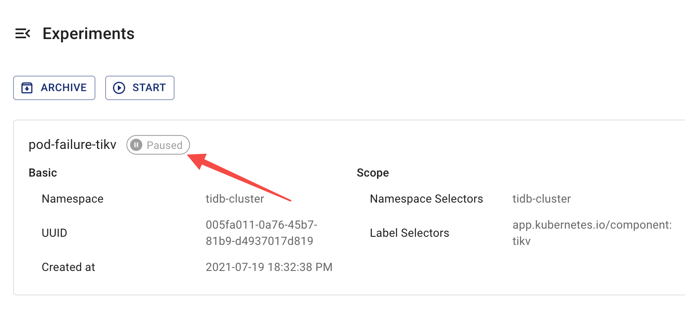

本文檔介紹如何使用 Chaos Mesh 檢查混沌實驗的運行狀態和結果。

## 混沌實驗步驟介紹

在 Chaos Mesh 中，混沌實驗的生命週期根據其運行過程分為四個步驟：

- 注入中（Injecting）：混沌實驗正在進行故障注入。通常此步驟持續時間較短。若「注入中」步驟持續過久，可能是因混沌實驗發生異常。此時可檢查 `Events` 以找出異常原因。

- 運行中（Running）：當故障成功注入所有目標 Pod 後，混沌實驗開始運行。

- 已暫停（Paused）：當對運行中的混沌實驗執行[暫停](run-a-chaos-experiment.md#pause-chaos-experiments)程序時，Chaos Mesh 會從所有目標 Pod 中恢復已注入的故障，表示實驗進入暫停狀態。

- 已完成（Finished）：若實驗配置了 `duration` 參數，且當實驗運行時間達到設定值時，Chaos Mesh 會從所有目標 Pod 恢復已注入的故障，表示實驗已完成。

## 使用 Chaos Dashboard 檢查結果

您可透過 Chaos Dashboard 在以下任一頁面查看混沌實驗的運行步驟：

- 混沌實驗清單：

  

- 混沌實驗詳細資訊：

  

:::note

- 若 **「注入中」** 步驟持續過久，可能是因混沌實驗出現異常（例如配置的選擇器未選中目標 Pod）。此時可檢查 **`Events`** 找出異常原因，並檢視混沌實驗配置。
- Chaos Dashboard 僅顯示[混沌實驗的主要步驟](#introduction-to-steps-of-a-chaos-experiment)。如需更詳細的實驗狀態與結果資訊，請執行 `kubectl` 命令。

:::

## 使用 `kubectl` 命令檢查結果

要確認混沌實驗結果，請使用以下 `kubectl describe` 命令檢查實驗物件的 `Status` 和 `Events`。

```shell
kubectl describe podchaos pod-failure-tikv -n tidb-cluster
```

預期輸出如下：

```shell
...
Status:
  Conditions:
    Reason:
    Status:  False
    Type:    Paused
    Reason:
    Status:  True
    Type:    Selected
    Reason:
    Status:  True
    Type:    AllInjected
    Reason:
    Status:  False
    Type:    AllRecovered
  Experiment:
    Container Records:
      Id:            tidb-cluster/basic-tikv-0
      Phase:         Injected
      Selector Key:  .
    Desired Phase:   Run
Events:
  Type    Reason           Age   From          Message
  ----    ------           ----  ----          -------
  Normal  FinalizerInited  39s   finalizer     Finalizer has been inited
  Normal  Paused           39s   desiredphase  Experiment has been paused
  Normal  Updated          39s   finalizer     Successfully update finalizer of resource
  Normal  Updated          39s   records       Successfully update records of resource
  Normal  Updated          39s   desiredphase  Successfully update desiredPhase of resource
  Normal  Started          17s   desiredphase  Experiment has started
  Normal  Updated          17s   desiredphase  Successfully update desiredPhase of resource
  Normal  Applied          17s   records       Successfully apply chaos for tidb-cluster/basic-tikv-0
  Normal  Updated          17s   records       Successfully update records of resource
```

上述輸出包含兩部分：

- `Status`

  根據混沌實驗運行過程，`Status` 提供四種狀態記錄：
  
  - `Paused`：表示混沌實驗處於「已暫停」步驟。
  - `Selected`：表示混沌實驗已正確選中需注入混沌動作的目標 Pod。
  - `AllInjected`：表示故障已成功注入所有目標 Pod。
  - `AllRecoverd`：表示已注入的故障已從所有目標 Pod 成功恢復。

  從這四種狀態記錄可推斷當前混沌實驗的實際運行狀態，例如：
  
  - 當 `Paused`、`Selected`、`AllRecoverd` 為 `True` 且 `AllInjected` 為 `False` 時，表示當前混沌實驗已暫停。
  - 當 `Paused` 為 `True` 時，表示實驗已暫停。但若同時 `Selected` 為 `False`，則表示當前實驗無法選中目標 Pod。

  :::note

  您可從上述狀態記錄的組合獲取更多資訊，例如當 `Paused` 為 `True` 時表示實驗暫停，但若同時 `Selected` 為 `False`，則表示當前實驗無法選中目標 Pod。

  :::

- `Events`

  包含混沌實驗整個生命週期中的操作記錄，有助於檢查實驗狀態及疑難排解問題。