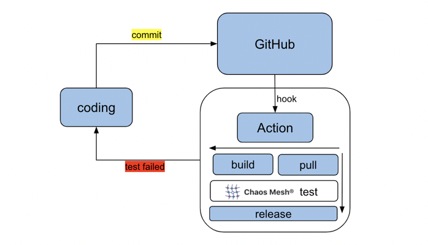

本文件說明如何使用 chaos-mesh-action 整合 Chaos Mesh 以自訂持續整合（CI）。這有助於您在產品發布前，識別系統開發中引入的問題。

chaos-mesh-action 是一個已在 [GitHub Marketplace](https://github.com/marketplace/actions/chaos-mesh) 發布的 GitHub action。其原始碼同樣可在 [GitHub](https://github.com/chaos-mesh/chaos-mesh-action) 上取得。

## chaos-mesh-action 的設計

[GitHub Action](https://docs.github.com/en/actions) 是 GitHub 原生支援的持續整合（CI）和持續部署（CD）功能。使用 GitHub Action，您可以在儲存庫中輕鬆自動化和自訂軟體開發工作流程。

配備 GitHub Action 後，Chaos Mesh 可輕鬆整合至您的日常開發和測試中，確保所有提交到 GitHub 的程式碼至少通過測試且沒有錯誤，同時不影響當前邏輯。下圖顯示 chaos-mesh-action 整合至 CI 工作流程的狀況：



## 在 GitHub 工作流程中使用 chaos-mesh-action

chaos-mesh-action 適用於 GitHub 工作流程。GitHub 工作流程是一個可配置的自動化流程。您可以在儲存庫中設定 GitHub 工作流程，以建置、測試、打包、發布或部署任何 GitHub 專案。要將 Chaos Mesh 整合至 CI，請遵循以下流程：

- 步驟 1：設計工作流程

- 步驟 2：建立工作流程

- 步驟 3：執行工作流程

### 步驟 1：設計工作流程

設計工作流程前，請考慮以下問題：

- 您想在此工作流程中測試哪些功能？

- 將注入何種類型的故障？

- 如何驗證系統的正確性？

例如，我們可以設計一個簡單的測試工作流程。以下步驟可包含在內：

1. 在 Kubernetes 叢集中建立兩個 Pod。

2. 從一個 Pod 傳送 ping 請求至另一個 Pod。

3. 使用 Chaos Mesh 注入網路延遲故障，以測試 ping 指令是否受到影響。

### 步驟 2：建立工作流程

設計工作流程後，請遵循以下步驟來建立工作流程。

1. 進入待測試軟體的 GitHub 儲存庫。

2. 點擊 `Actions`，然後點擊 `New workflow` 來建立工作流程。


本質上，工作流程是一個順序性的自動化作業配置。請注意，以下作業配置在單一檔案中。為提供清晰說明，腳本被拆分為不同的工作群組，如下所示：

- 設定工作流程名稱和觸發規則。

  將工作流程命名為 "Chaos"。當您提交程式碼或建立拉取請求至 master 分支時，此工作流程將被觸發。

  ```yaml
  name: Chaos

  on:
    push:
      branches:
        - master
    pull_request:
      branches:
        - master
  ```

- 安裝 CI 相關環境。

  此配置指定了作業系統（Ubuntu），並使用 helm/kind-action 創建 Kind 叢集。之後，它會印出叢集資訊。最後，它會簽出（checkout）工作流程將要存取的 GitHub 儲存庫。

  ```yaml
  jobs:
    build:
      runs-on: ubuntu-latest
      steps:
        - name: Creating kind cluster
          uses: helm/kind-action@v1.0.0-rc.1

        - name: Print cluster information
          run: |
            kubectl config view
            kubectl cluster-info
            kubectl get nodes
            kubectl get pods -n kube-system
            helm version
            kubectl version

        - uses: actions/checkout@v2
  ```

- 部署應用程式。

  在以下範例中，此工作部署了一個會創建兩個 Kubernetes Pod 的應用程式。

  ```yaml
  - name: Deploy an application
       run: |
         kubectl apply -f https://raw.githubusercontent.com/chaos-mesh/apps/master/ping/busybox-statefulset.yaml
  ```

- 使用 Chaos Mesh 注入故障。

  ```yaml
  - name: Run chaos mesh action
      uses: chaos-mesh/chaos-mesh-action@v0.5
      env:
        CHAOS_MESH_VERSION: v1.0.0
        CFG_BASE64: YXBpVmVyc2lvbjogY2hhb3MtbWVzaC5vcmcvdjFhbHBoYTEKa2luZDogTmV0d29ya0NoYW9zCm1ldGFkYXRhOgogIG5hbWU6IG5ldHdvcmstZGVsYXkKICBuYW1lc3BhY2U6IGJ1c3lib3gKc3BlYzoKICBhY3Rpb246IGRlbGF5ICMgdGhlIHNwZWNpZmljIGNoYW9zIGFjdGlvbiB0byBpbmplY3QKICBtb2RlOiBhbGwKICBzZWxlY3RvcjoKICAgIHBvZHM6CiAgICAgIGJ1c3lib3g6CiAgICAgICAgLSBidXN5Ym94LTAKICBkZWxheToKICAgIGxhdGVuY3k6ICIxMG1zIgogIGR1cmF0aW9uOiAiNXMiCiAgc2NoZWR1bGVyOgogICAgY3JvbjogIkBldmVyeSAxMHMiCiAgZGlyZWN0aW9uOiB0bwogIHRhcmdldDoKICAgIHNlbGVjdG9yOgogICAgICBwb2RzOgogICAgICAgIGJ1c3lib3g6CiAgICAgICAgICAtIGJ1c3lib3gtMQogICAgbW9kZTogYWxsCg==
  ```

  使用 chaos-mesh-action 時，Chaos Mesh 會被自動安裝並注入故障。您只需要準備混沌實驗的配置並將其值以 base64 編碼。如果想對 Pod 注入網路延遲，可以使用以下配置範例：

  ```yaml
  apiVersion: chaos-mesh.org/v1alpha1
  kind: NetworkChaos
  metadata:
    name: network-delay
    namespace: busybox
  spec:
    action: delay # the specific chaos action to inject
    mode: all
    selector:
      pods:
        busybox:
          - busybox-0
    delay:
      latency: '10ms'
    duration: '5s'
    scheduler:
      cron: '@every 10s'
    direction: to
    target:
      selector:
        pods:
          busybox:
            - busybox-1
      mode: all
  ```

  使用以下命令取得上述混沌實驗配置檔案的 base64 編碼值：

  ```bash
  base64 chaos.yaml
  ```

- 驗證系統的正確性。

  在此作業中，工作流程從一個 Pod 向另一個 Pod 發送 ping 請求並觀察網路延遲。

  ```yaml
  - name: Verify
       run: |
         echo "do some verification"
         kubectl exec busybox-0 -it -n busybox -- ping -c 30 busybox-1.busybox.busybox.svc
  ```

### 步驟 3：執行工作流程

一旦工作流程建立，您可以透過建立一個 pull request 到 master 分支來觸發它。當工作流程完成執行後，作業驗證的輸出類似於以下內容：

```log
do some verification
Unable to use a TTY - input is not a terminal or the right kind of file
PING busybox-1.busybox.busybox.svc (10.244.0.6): 56 data bytes
64 bytes from 10.244.0.6: seq=0 ttl=63 time=0.069 ms
64 bytes from 10.244.0.6: seq=1 ttl=63 time=10.136 ms
64 bytes from 10.244.0.6: seq=2 ttl=63 time=10.192 ms
64 bytes from 10.244.0.6: seq=3 ttl=63 time=10.129 ms
64 bytes from 10.244.0.6: seq=4 ttl=63 time=10.120 ms
64 bytes from 10.244.0.6: seq=5 ttl=63 time=0.070 ms
64 bytes from 10.244.0.6: seq=6 ttl=63 time=0.073 ms
64 bytes from 10.244.0.6: seq=7 ttl=63 time=0.111 ms
64 bytes from 10.244.0.6: seq=8 ttl=63 time=0.070 ms
64 bytes from 10.244.0.6: seq=9 ttl=63 time=0.077 ms
……
```

輸出顯示一系列 10 毫秒的延遲，每次延遲持續 5 秒（共 5 次）。這與使用 chaos-mesh-action 注入的混沌實驗配置一致。

## 後續步驟

目前，chaos-mesh-action 已應用於 [TiDB Operator](https://github.com/pingcap/tidb-operator)。透過在工作流程中注入 Pod 故障，您可以驗證 Operator 實例的重啟。這確保了當 TiDB Operator 的一個 Pod 被注入的故障隨機刪除時，TiDB Operator 仍能正常運作。詳情請參閱 [TiDB Operator 工作流程頁面](https://github.com/pingcap/tidb-operator/actions?query=workflow%3Achaos)。

未來，chaos-mesh-action 將應用於更多的 TiDB 測試中，以確保 TiDB 及其元件的穩定性。歡迎您使用 chaos-mesh-action 來建立自己的工作流程。

If you find any issue in chaos-mesh-action, or find any information is missing, you are welcome to create an [GitHub issue](https://github.com/pingcap/chaos-mesh/issues) or a [pull request (PR)](https://github.com/chaos-mesh/chaos-mesh/pulls) in the Chaos Mesh repository. You can also join our slack channel [#project-chaos-mesh](https://slack.cncf.io/) in the [CNCF](https://www.cncf.io/) workspace.