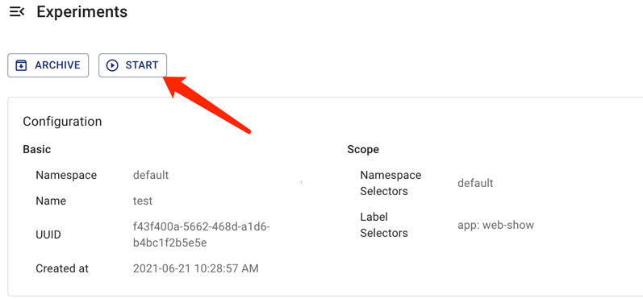
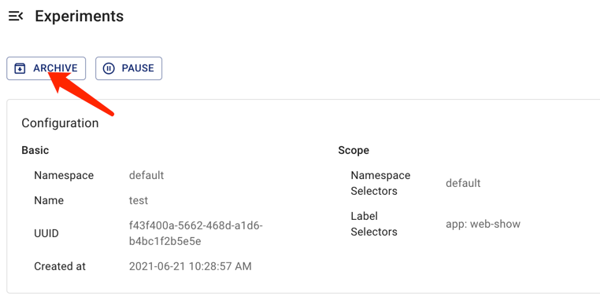

本文說明如何在 Chaos Mesh 中建立、執行、檢視、暫停、更新及刪除混沌實驗。

## 建立混沌實驗

您可以在 Chaos Mesh 中建立以下類型的混沌實驗：

- One-time Chaos experiments: The smallest instance of Chaos experiments. Once a one-time experiment is created, Chaos Mesh immediately injects faults into the target test machine according to the experiment configurations. If the `duration` parameter is configured, injected faults will be restored automatically after a period of time specified by `duration`. When the Chaos experiment is paused or deleted, injected faults will be restored immediately.

- 排程或循環混沌實驗：可定期或循環執行的混沌實驗。建立此類實驗時需定義實驗的排程規則。

### 一次性混沌實驗

若要建立一次性混沌實驗，可使用以下任一方法：

- 使用 Chaos Dashboard 建立新混沌實驗，點擊 **Submit** 執行實驗。詳情請參閱各混沌實驗類型的文件。

- 使用 YAML 檔案定義混沌實驗，再透過 `kubectl` 建立並執行實驗。採用此方式時請依循以下步驟：

1. Create a new YAML file to define a Chaos experiment. Add configuration parameters in the file based on the type of Chaos experiment you want to create.

   Take a NetworkChaos experiment as an example. Save the following YAML text as `network-delay.yaml`.

   ```yaml
   apiVersion: chaos-mesh.org/v1alpha1
   kind: NetworkChaos
   metadata:
     name: network-delay
   spec:
     action: delay # the specific chaos action to inject
     mode: one # the mode to run chaos action; supported modes are one/all/fixed/fixed-percent/random-max-percent
     selector: # pods where to inject chaos actions
       namespaces:
         - default
       labelSelectors:
         'app': 'web-show' # the label of the pod for chaos injection
     delay:
       latency: '10ms'
     duration: '12s'
   ```

   The above YAML example defines a network latency fault lasting for `12 seconds`, targeting applications with the `"app": "web-show"` tag under the `default` namespace. For more configuration information about the NetworkChaos experiment, refer to [Simulate network chaos](simulate-network-chaos-on-kubernetes.md).

2. 執行以下指令建立並運行此混沌實驗。

   ```sh
   kubectl apply -f network-delay.yaml
   ```

3. 實驗開始後，可使用以下 `kubectl describe` 指令查看實驗物件的 `status` 或 `event` 以監控運行狀態。

   ```sh
   kubectl describe networkchaos network-delay
   ```

   有關檢查混沌實驗結果的詳細步驟，請參閱[檢查混沌實驗](inspect-chaos-experiments.md)。

### 排程或循環混沌實驗

Chaos Mesh 提供 `Schedule` 物件用於建立排程混沌實驗和循環混沌實驗。

建立此類實驗時請依循以下步驟：

1. 建立一個新的 YAML 檔案來定義混沌實驗。你需要在 YAML 檔案中配置 `Schedule` 參數來定義實驗的具體排程規則，然後根據要建立的混沌實驗類型配置其他參數。

   以排程型 NetworkChaos 實驗為例，將以下 YAML 文字儲存為 `schedule-delay-example.yaml`。

   ```yaml
   apiVersion: chaos-mesh.org/v1alpha1
   kind: Schedule
   metadata:
     name: schedule-delay-example
   spec:
     schedule: '5 * * * *'
     historyLimit: 2
     concurrencyPolicy: 'Allow'
     type: 'NetworkChaos'
     networkChaos:
       action: delay
       mode: one
       selector:
         namespaces:
           - default
         labelSelectors:
           'app': 'web-show'
       delay:
         latency: '10ms'
       duration: '12s'
   ```

   上述 YAML 範例定義了一個會在每小時第 5 分鐘自動觸發的網路延遲故障。關於排程規則的詳細介紹，請參閱[定義排程規則](define-scheduling-rules.md)。

   :::note

   若未設置 `duration` 參數，故障行為將持續生效直到你暫停或刪除混沌實驗。

   ::>

2. 執行以下指令來建立並運行此混沌實驗。

   ```sh
   kubectl apply -f schedule-delay-example.yaml
   ```

3. 實驗開始後，要查看混沌實驗的運行狀態，可使用以下 `kubectl describe` 指令檢查實驗物件的 `status` 或 `event`。

   ```sh
   kubectl describe networkchaos schedule-delay-example
   ```

   查看混沌實驗結果的詳細步驟，請參閱[檢查混沌實驗](inspect-chaos-experiments.md)。

## 暫停混沌實驗

### 使用指令暫停或恢復混沌實驗

對於運行中的混沌實驗，你可以透過指令為其設置暫停註解來暫停實驗。

例如，可以使用以下指令暫停預設命名空間中名為 `network-delay` 的混沌實驗：

```sh
kubectl annotate networkchaos network-delay experiment.chaos-mesh.org/pause=true
```

此指令執行後，Chaos Mesh 會立即恢復注入的故障。若要將此混沌實驗從暫停狀態恢復至正常運行狀態，請使用以下指令：

```sh
kubectl annotate networkchaos network-delay experiment.chaos-mesh.org/pause-
```

### 使用 Chaos Dashboard 暫停或恢復混沌實驗

若要透過 Chaos Dashboard 暫停或恢復混沌實驗，請在儀表板上找到目標實驗，點擊 **Pause** 按鈕或 **Start** 按鈕。




## 更新混沌實驗

### 使用指令更新混沌實驗

目前混沌實驗的 `Spec` 欄位不允許更新。

詳情請參閱相關 [GitHub issue](https://github.com/chaos-mesh/chaos-mesh/issues/2227)。

### 使用 Chaos Dashboard 更新混沌實驗

由於混沌實驗的 `Spec` 欄位不允許更新，目前 Chaos Dashboard 不支援更新混沌實驗。

## 刪除混沌實驗

### 使用指令刪除混沌實驗

混沌實驗結束後，你可以使用以下 `kubectl delete` 指令刪除實驗。刪除混沌實驗後，注入的故障會立即恢復：

```sh
kubectl delete -f network-delay.yaml
# or delete the chaos object directly
kubectl delete networkchaos network-delay
```

若刪除操作被阻塞，這表示目標物件的某些故障行為無法恢復。你可以檢查 Chaos Mesh 日誌進行故障排除，或直接建立 [GitHub issue](https://github.com/pingcap/chaos-mesh/issues) 向 Chaos Mesh 團隊報告此問題。此外，你也可以使用以下指令強制刪除混沌實驗：

```sh
kubectl annotate networkchaos web-show-network-delay chaos-mesh.chaos-mesh.org/cleanFinalizer=forced
```

### 使用 Chaos Dashboard 刪除混亂實驗

若您想在 Chaos Dashboard 上刪除混亂實驗並將其歸檔至實驗歷史記錄，可以點擊該混亂實驗對應的 **Archive** 按鈕。

