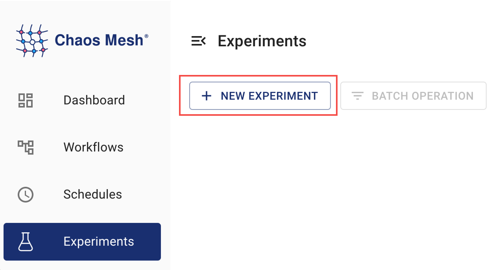

本文說明如何使用 Chaos Mesh 向 GCP Pod 注入故障。提供 Chaos Dashboard 和 YAML 檔案來建立 GCPChaos 實驗。

## GCPChaos 介紹

GCPChaos 是 Chaos Mesh 中的一種故障類型。通過建立 GCPChaos 實驗，您可以模擬指定 GCP 執行個體的故障場景。目前 GCPChaos 支援以下故障類型：

- **Node Stop**：停止指定的 GCP 執行個體。

- **Node Reset**：重新啟動指定的 GCP 執行個體。

- **Disk Loss**：從指定的 GCP 執行個體卸載儲存卷。

## `Secret` 檔案

為便於連接 GCP 叢集，您可以預先建立 Kubernetes `Secret` 檔案來儲存認證資訊。

以下是 `secret` 檔案的範例：

```yaml
apiVersion: v1
kind: Secret
metadata:
  name: cloud-key-secret
  namespace: chaos-mesh
type: Opaque
stringData:
  service_account: your-gcp-service-account-base64-encode
```

- **name** 定義 Kubernetes secret 的名稱。

- **namespace** 定義 Kubernetes secret 的命名空間。

- **service_account** 儲存 GCP 叢集的服務帳戶金鑰。請記得對 GCP 服務帳戶金鑰進行 [Base64](https://zh.wikipedia.org/wiki/Base64) 編碼。詳細資訊請參閱[建立及管理服務帳戶金鑰](https://cloud.google.com/iam/docs/creating-managing-service-account-keys)。

## 使用 Chaos Dashboard 建立實驗

:::note

使用 Chaos Dashboard 建立實驗前，請確保滿足以下要求：

1. 已安裝 Chaos Dashboard。
2. 可透過 `kubectl port-forward` 命令存取 Chaos Dashboard：

   ```bash
   kubectl port-forward -n chaos-mesh svc/chaos-dashboard 2333:2333
   ```

   然後即可在瀏覽器中透過 [`http://localhost:2333`](http://localhost:2333) 存取儀表板。

:::

1. 開啟 Chaos Dashboard，點擊頁面上的 **NEW EXPERIMENT** 建立新實驗：

   

2. 在 **Choose a Target** 區域，選擇 **GCP fault** 並選取特定行為，例如 **STOP NODE**：

   

3. 填寫實驗資訊，並指定實驗範圍與排程實驗持續時間：

   

   

4. 提交實驗資訊。

## 使用 YAML 檔案建立實驗

### `node-stop` 配置範例

1. 將實驗配置寫入 `gcpchaos-node-stop.yaml`，如下所示：

   ```yaml
   apiVersion: chaos-mesh.org/v1alpha1
   kind: GCPChaos
   metadata:
     name: node-stop-example
     namespace: chaos-mesh
   spec:
     action: node-stop
     secretName: 'cloud-key-secret'
     project: 'your-project-id'
     zone: 'your-zone'
     instance: 'your-instance-name'
     duration: '5m'
   ```

   基於此配置範例，Chaos Mesh 將向指定 GCP 執行個體注入 `node-stop` 故障，使該 GCP 執行個體在 5 分鐘內不可用。

   有關停止 GCP 執行個體的詳細資訊，請參閱[停止 GCP 執行個體](https://cloud.google.com/compute/docs/instances/stop-start-instance)。

2. 準備好配置檔案後，使用 `kubectl` 建立實驗：

   ```bash
   kubectl apply -f gcpchaos-node-stop.yaml
   ```

### `node-reset` 配置範例

1. 將實驗配置寫入 `gcpchaos-node-reset.yaml` 檔案中，如下所示：

   ```yaml
   apiVersion: chaos-mesh.org/v1alpha1
   kind: GCPChaos
   metadata:
     name: node-reset-example
     namespace: chaos-mesh
   spec:
     action: node-reset
     secretName: 'cloud-key-secret'
     project: 'your-project-id'
     zone: 'your-zone'
     instance: 'your-instance-name'
     duration: '5m'
   ```

   根據此配置範例，Chaos Mesh 會將 `node-reset` 故障注入指定的 GCP 實例，使得該 GCP 實例將會被重設。

   有關重設 GCP 實例的更多資訊，請參閱 [重設 GCP 實例](https://cloud.google.com/compute/docs/instances/stop-start-instance#resetting_an_instance)。

2. 配置文件準備好後，使用 `kubectl` 創建實驗：

   ```bash
   kubectl apply -f gcpchaos-node-reset.yaml
   ```

### `disk-loss` 配置範例

1. 將實驗配置寫入 `gcpchaos-disk-loss.yaml` 檔案中，如下所示：

   ```yaml
   apiVersion: chaos-mesh.org/v1alpha1
   kind: GCPChaos
   metadata:
     name: disk-loss-example
     namespace: chaos-mesh
   spec:
     action: disk-loss
     secretName: 'cloud-key-secret'
     project: 'your-project-id'
     zone: 'your-zone'
     instance: 'your-instance-name'
     deviceNames: ['disk-name']
     duration: '5m'
   ```

   根據此配置範例，Chaos Mesh 會將 `disk-loss` 故障注入指定的 GCP 實例，使得該 GCP 實例在 5 分鐘內與指定的儲存磁碟分離。

   有關分離 GCP 實例的更多資訊，請參閱 [分離 GCP 儲存](https://cloud.google.com/compute/docs/reference/rest/v1/instances/detachDisk)。

2. 配置文件準備好後，使用 `kubectl` 創建實驗：

   ```bash
   kubectl apply -f gcpchaos-disk-loss.yaml
   ```

### 欄位說明

下表顯示了 YAML 配置檔案中的欄位。

| Parameter | Type | Descpription | Default value | Required | Example |
| --- | --- | --- | --- | --- | --- |
| action | string | Indicates the specific type of faults. The available fault types include node-stop, node-reset, and disk-loss. | node-stop | Yes | node-stop |
| mode | string | Indicates the mode of the experiment. The mode options include `one` (selecting a Pod at random), `all` (selecting all eligible Pods), `fixed` (selecting a specified number of eligible Pods), `fixed-percent` (selecting a specified percentage of the eligible Pods), and `random-max-percent` (selecting the maximum percentage of the eligible Pods). | None | Yes | `one` |
| value | string | Provides parameters for the `mode` configuration, depending on `mode`. For example, when `mode` is set to `fixed-percent`, `value` specifies the percentage of pods. | None | No | 1 |
| secretName | string | Indicates the name of the Kubernetes secret that stores the GCP authentication information. | None | No | cloud-key-secret |
| project | string | Indicates the ID of GCP project. | None | Yes | real-testing-project |
| zone | string | Indicates the region of GCP instance. | None | Yes | us-central1-a |
| instance | string | Indicates the name of GCP instance. | None | Yes | gke-xxx-cluster--default-pool-xxx-yyy |
| deviceNames | []string | This is a required field when the `action` is `disk-loss`. This field specifies the machine disk ID. | None | no | ["your-disk-id"] |
| duration | string | Indicates the duration of the experiment. | None | Yes | 30s |