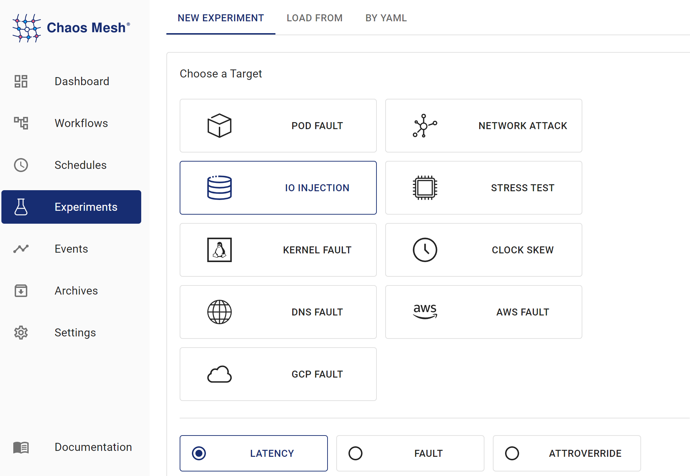

本文件說明如何在 Chaos Mesh 中建立 IOChaos 實驗。

## IOChaos 簡介

IOChaos 是 Chaos Mesh 中的一種故障類型。透過建立 IOChaos 實驗，您可以模擬檔案系統故障的情境。目前 IOChaos 支援以下故障類型：

- `latency`：延遲檔案系統呼叫

- `fault`：返回檔案系統呼叫錯誤

- `attrOverride`：修改檔案屬性

- `mistake`：使檔案讀取或寫入錯誤數值

具體功能詳見[使用 YAML 檔案建立實驗](#create-experiments-using-the-yaml-files)。

## 注意事項

1. 建立 IOChaos 實驗前，請確認目標 Pod 上未運行 Chaos Mesh 的控制管理器。

2. IOChaos 可能損壞您的資料。請**謹慎**在生產環境中使用 IOChaos。

## 使用 Chaos Dashboard 建立實驗

1. 開啟 Chaos Dashboard，點擊頁面中的 **NEW EXPERIMENT** 建立新實驗：

   

2. 在 **Choose a Target** 區域，選擇 **FILE SYSTEM INJECTION** 並選取特定故障類型，例如 **LATENCY**。

   

3. 填寫實驗資訊，並指定實驗範圍與排程實驗持續時間。

   

4. 提交實驗資訊。

## 使用 YAML 檔案建立實驗

### 延遲範例

1. 將實驗配置寫入 `io-latency.yaml` 檔案，如下所示：

   ```yaml
   apiVersion: chaos-mesh.org/v1alpha1
   kind: IOChaos
   metadata:
     name: io-latency-example
     namespace: chaos-mesh
   spec:
     action: latency
     mode: one
     selector:
       labelSelectors:
         app: etcd
     volumePath: /var/run/etcd
     path: '/var/run/etcd/**/*'
     delay: '100ms'
     percent: 50
     duration: '400s'
   ```

   在此配置範例中，Chaos Mesh 向 `/var/run/etcd` 目錄注入延遲，對此目錄中的所有檔案系統操作（包含讀取、寫入、列出內容等）產生 100 毫秒的延遲。

2. 準備好配置檔案後，使用 `kubectl` 建立實驗：

   ```bash
   kubectl apply -f ./io-latency.yaml
   ```

### 故障範例

1. 將實驗配置寫入 `io-fault.yaml` 檔案，如下所示：

   ```yaml
   apiVersion: chaos-mesh.org/v1alpha1
   kind: IOChaos
   metadata:
     name: io-fault-example
     namespace: chaos-mesh
   spec:
     action: fault
     mode: one
     selector:
       labelSelectors:
         app: etcd
     volumePath: /var/run/etcd
     path: /var/run/etcd/**/*
     errno: 5
     percent: 50
     duration: '400s'
   ```

   在此範例中，Chaos Mesh 向 `/var/run/etcd` 目錄注入檔案故障，對此目錄下的所有檔案系統操作給予 50% 的失敗機率，並返回錯誤碼 5（輸入/輸出錯誤）。

2. 準備好配置檔案後，使用 `kubectl` 建立實驗：

   ```bash
   kubectl apply -f ./io-fault.yaml
   ```

### attrOverride 範例

1. Write the experiment configuration to the `io-attr.yaml` file:

   ```yaml
   apiVersion: chaos-mesh.org/v1alpha1
   kind: IOChaos
   metadata:
     name: io-attr-example
     namespace: chaos-mesh
   spec:
     action: attrOverride
     mode: one
     selector:
       labelSelectors:
         app: etcd
     volumePath: /var/run/etcd
     path: /var/run/etcd/**/*
     attr:
       perm: 72
     percent: 10
     duration: '400s'
   ```

   In this configuration example, Chaos Mesh injects `/var/run/etcd` directories `attrOverride` fault, giving a 10% probability that all file system operations in this directory will change the target file permissions to 72 (110 in octal), which will allow files to be executed only by the owner and their group and not authorized to perform other actions.

2. 準備好配置檔案後，使用 `kubectl` 創建實驗：

   ```bash
   kubectl apply -f ./io-attr.yaml
   ```

### 錯誤值注入範例

1. 將實驗配置寫入 `io-mistake.yaml` 檔案：

   ```yaml
   apiVersion: chaos-mesh.org/v1alpha1
   kind: IOChaos
   metadata:
     name: io-mistake-example
     namespace: chaos-mesh
   spec:
     action: mistake
     mode: one
     selector:
       labelSelectors:
         app: etcd
     volumePath: /var/run/etcd
     path: /var/run/etcd/**/*
     mistake:
       filling: zero
       maxOccurrences: 1
       maxLength: 10
     methods:
       - READ
       - WRITE
     percent: 10
     duration: '400s'
   ```

   在此配置範例中，Chaos Mesh 對 `/var/run/etcd` 目錄注入讀寫故障，使該目錄下的讀寫操作有 10% 機率失敗。此過程中，將隨機選取一個最大長度為 10 位元組的位置，並以 0 位元組取代原始內容。

2. 準備好配置檔案後，使用 `kubectl` 創建實驗：

   ```bash
   kubectl apply -f ./io-mistake.yaml
   ```

### 欄位說明

#### 通用欄位

| Parameter | Type | Description | Default value | Required | Example |
| --- | --- | --- | --- | --- | --- |
| action | string | Indicates the specific type of faults. Only latency, fault, attrOverride, and mistake are supported. |  | Yes | latency |
| mode | string | Specifies the mode of the experiment. The mode options include `one` (selecting a Pod at random), `all` (selecting all eligible Pods), `fixed` (selecting a specified number of eligible Pods), `fixed-percent` (selecting a specified percentage of the eligible Pods), and `random-max-percent` (selecting the maximum percentage of the eligible Pods). | None | Yes | `one` |
| selector | struct | Specifies the target Pod. For details, refer to [Define the experiment scope](./define-chaos-experiment-scope.md). | None | Yes |  |
| value | string | Provides parameters for the `mode` configuration, depending on `mode`. For example, when `mode` is set to `fixed-percent`, `value` specifies the percentage of Pods. |  | No | 1 |
| volumePath | string | The mount point of volume in the target container. Must be the root directory of the mount. |  | Yes | /var/run/etcd |
| path | string | The valid range of fault injections, either a wildcard or a single file. | Valid for all files by default | No | /var/run/etcd/\*_/_ |
| methods | []string | Type of the file system call that requires injecting fault. For more information about supported types, refer to [Appendix A](#appendix-a: methods-type). | All Types | No | READ |
| percent | int | Probability of failure per operation, in %. | 100 | No | 100 |
| containerNames | []string | Specifies the name of the container into which the fault is injected. |  | No |  |
| duration | string | Specifies the duration of the experiment. |  | Yes | 30s |

#### 操作相關欄位

以下是 action 對應欄位的具體說明：

- latency

  | 參數    | 類型   | 說明         | 預設值 | 必填 | 範例    |
  | ------- | ------ | ------------ | ------ | ---- | ------- |
  | delay   | string | 具體延遲時間 |        | 是   | 100 ms  |

- fault

  | 參數  | 類型 | 說明           | 預設值 | 必填 | 範例 |
  | ----- | ---- | -------------- | ------ | ---- | ---- |
  | errno | int  | 返回的錯誤代碼 |        | 是   | 22   |

  常見錯誤代碼請參閱[附錄 B](#appendix-b-common-error-numbers)。

- attrOverride

  | 參數 | 類型 | 描述 | 預設值 | 是否必填 | 範例 |
  | --------- | ---------------- | -------------------------------- | ------------- | -------- | ---------- |
  | attr      | AttrOverrideSpec | 特定屬性覆寫規則 |               | 是      | 如下所示 |

  AttrOverrideSpec 定義如下：

  | 參數 | 類型 | 描述 | 預設值 | 是否必填 | 範例 |
  | --- | --- | --- | --- | --- | --- |
  | ino | int | ino 編號 |  | 否 |  |
  | size | int | 檔案大小 |  | 否 |  |
  | blocks | int | 檔案使用的區塊數量 |  | 否 |  |
  | atime | TimeSpec | 最後存取時間 |  | 否 |  |
  | mtime | TimeSpec | 最後修改時間 |  | 否 |  |
  | ctime | TimeSpec | 最後狀態變更時間 |  | 否 |  |
  | kind | string | 檔案類型，參見 [fuser::FileType](https://docs.rs/fuser/0.7.0/fuser/enum.FileType.html) |  | 否 |  |
  | perm | int | 檔案權限（十進制表示） |  | 否 | 72（八進制為 110） |
  | nlink | int | 硬連結數量 |  | 否 |  |
  | `uid` | int | 擁有者的使用者 ID |  | 否 |  |
  | gid | int | 擁有者的群組 ID |  | 否 |  |
  | rdev | int | 裝置 ID |  | 否 |  |

  TimeSpec 定義如下：

  | 參數 | 類型 | 描述              | 預設值 | 是否必填 | 範例 |
  | --------- | ---- | ------------------------ | ------------- | -------- | ------- |
  | sec       | int  | 時間戳（秒）     |               | 否       |         |
  | nsec      | int  | 時間戳（奈秒） |               | 否       |         |

  參數的具體含義可參考 [man stat](https://man7.org/linux/man-pages/man2/lstat.2.html)。

- mistake

  | 參數 | 類型 | 描述          | 預設值 | 是否必填 | 範例 |
  | --------- | ----------- | -------------------- | ------------- | -------- | ------- |
  | mistake   | MistakeSpec | 特定錯誤規則 |               | 是      |         |

  MistakeSpec 定義如下：

  | 參數 | 類型 | 描述 | 預設值 | 是否必填 | 範例 |
  | --- | --- | --- | --- | --- | --- |
  | filling | string | 要填充的錯誤數據。僅支援 zero（填充 0）或 random（填充隨機位元組） |  | 是 |  |
  | maxOccurrences | int | 每次操作的最大錯誤發生次數 |  | 是 | 1 |
  | maxLength | int | 每個錯誤的最大長度（單位：位元組） |  | 是 | 1 |

:::warning 建議僅在 READ 和 WRITE 檔案系統調用上使用 mistake。在其他檔案系統調用上使用 mistake 可能導致意外後果，包括但不限於檔案系統損壞和程序崩潰。 :::

## 本地調試

若不確定某個 Chaos 的實際效果，可使用 [toda](https://github.com/chaos-mesh/toda) 在本地測試功能。Chaos Mesh 同樣使用 toda 來實現 IOChaos。

## 附錄 A：方法類型

- lookup

- forget

- getattr

- setattr

- readlink

- mknod

- mkdir

- unlink

- rmdir

- symlink

- rename

- link

- open

- read

- write

- flush

- release

- fsync

- opendir

- readdir

- releasedir

- fsyncdir

- statfs

- setxattr

- getxattr

- listxattr

- removexatr

- access

- create

- getlk

- setlk

- bmap

更多資訊，請參閱 [fuser::Filesystem](https://docs.rs/fuser/0.7.0/fuser/trait.Filesystem.html)。

## 附錄 B：常見錯誤號碼

- 1：不允許的操作

- 2：沒有此檔案或目錄

- 5：I/O 錯誤

- 6：沒有此裝置或位址

- 12：記憶體不足

- 16：裝置或資源忙碌中

- 17：檔案已存在

- 20：不是目錄

- 22：無效參數

- 24：開啟檔案過多

- 28：裝置空間不足

更多資訊，請參閱 [Linux 原始碼](https://raw.githubusercontent.com/torvalds/linux/master/include/uapi/asm-generic/errno-base.h)。