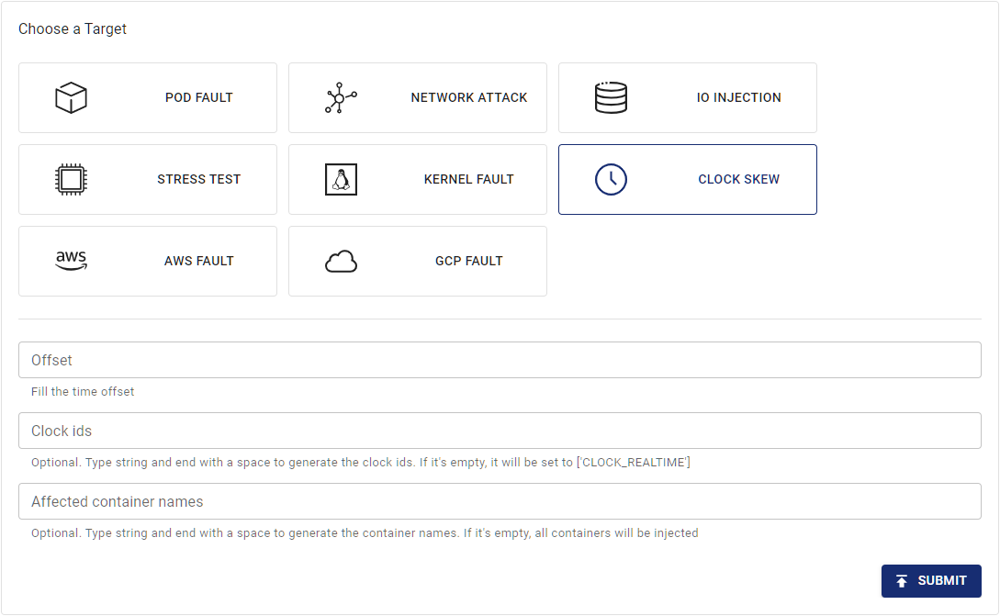

## TimeChaos 簡介

Chaos Mesh 提供了 TimeChaos 實驗類型。您可以使用此實驗類型來模擬時間偏移情境。本文件描述如何建立 TimeChaos 實驗及其相關設定檔。

:::note

TimeChaos 只會影響容器 PID 命名空間中的 PID `1` 程序，以及 PID `1` 的子程序。例如，由 `kubectl exec` 啟動的程序不會受到影響。

:::

您可以在 Chaos Dashboard 或使用 YAML 設定檔來建立實驗。

## 使用 Chaos Dashboard 建立實驗

1. 開啟 Chaos Dashboard，然後點擊頁面上的 **NEW EXPERIMENT** 以建立新實驗：

   

2. 在 **Choose a Target** 區域中，選擇 **CLOCK SCREW** 並填寫 Clock ID 和時間偏移量：

   

3. 填寫實驗資訊，並指定實驗範圍和排定的實驗持續時間：

   

4. 提交實驗資訊。

## 使用 YAML 檔案建立實驗

1. 將實驗設定寫入 YAML 設定檔。以下範例使用 `time-shift.yaml` 檔案：

   ```yaml
   apiVersion: chaos-mesh.org/v1alpha1
   kind: TimeChaos
   metadata:
     name: time-shift-example
     namespace: chaos-mesh
   spec:
     mode: one
     selector:
       labelSelectors:
         'app': 'app1'
     timeOffset: '-10m100ns'
   ```

   此實驗設定會將指定 Pod 中程序的時間向前偏移 10 分鐘和 100 奈秒。

2. 準備好設定檔後，使用 `kubectl` 來建立實驗：

   ```bash
   kubectl apply -f time-shift.yaml
   ```

YAML 設定檔中的欄位描述如下表所示：

| Parameter | Type | Note | Default value | Required | Example |
| --- | --- | --- | --- | --- | --- |
| timeOffset | string | Specifies the length of time offset. | None | Yes | `-5m` |
| clockIds | []string | Specifies the ID of clock that will be offset. See the [<clock>clock_gettime</clock> documentation](https://man7.org/linux/man-pages/man2/clock_gettime.2.html) for details. | `["CLOCK_REALTIME"]` | No | `["CLOCK_REALTIME", "CLOCK_MONOTONIC"]` |
| mode | string | Specifies the mode of the experiment. The mode options include `one` (selecting a random Pod), `all` (selecting all eligible Pods), `fixed` (selecting a specified number of eligible Pods), `fixed-percent` (selecting a specified percentage of Pods from the eligible Pods), and `random-max-percent` (selecting the maximum percentage of Pods from the eligible Pods). | None | Yes | `one` |
| value | string | Provides parameters for the `mode` configuration, depending on `mode`.For example, when `mode` is set to `fixed-percent`, `value` specifies the percentage of Pods. | None | No | 1 |
| containerNames | []string | Specifies the name of the container into which the fault is injected. | None | No | `["nginx"]` |
| selector | struct | Specifies the target Pod. For details, refer to [Define the experiment scope](./define-chaos-experiment-scope.md). | None | Yes |  |