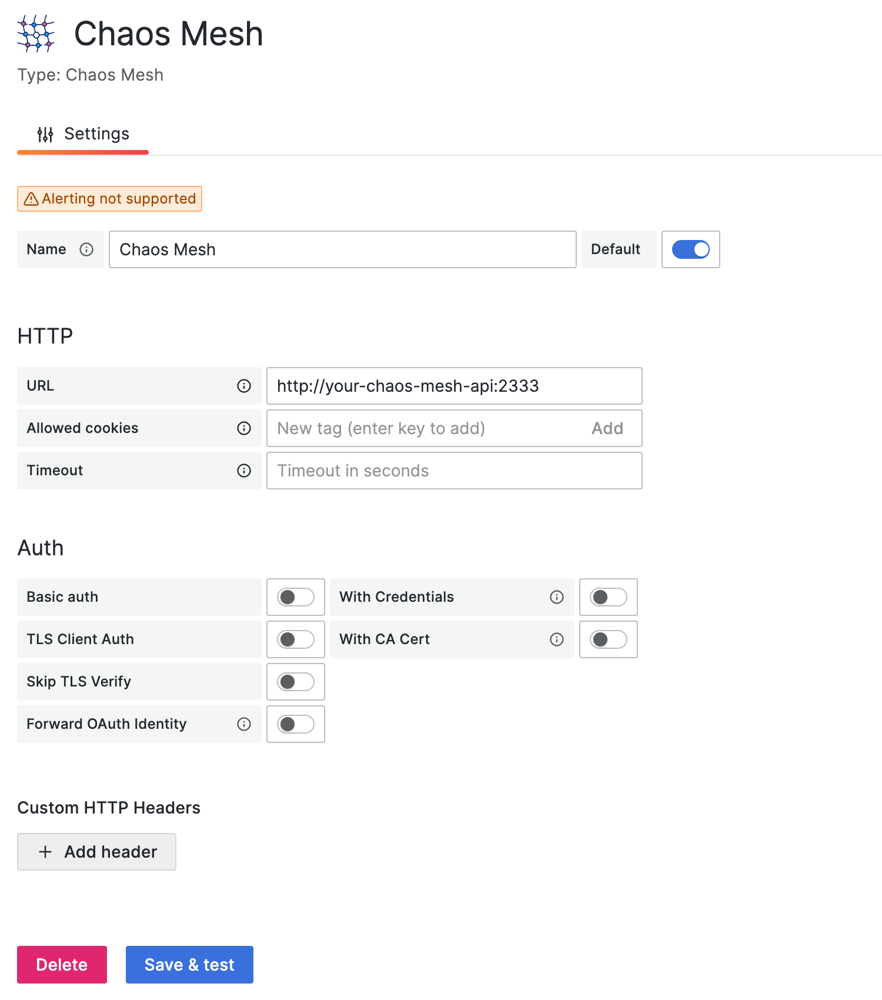
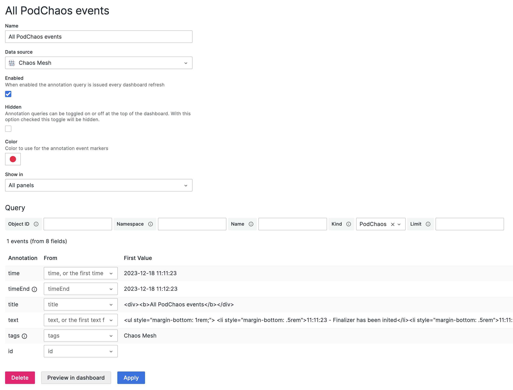

本文檔說明如何安裝 Grafana 的 Data Source 外掛程式，並設定該外掛程式以觀察 Chaos Mesh 事件。

:::note

此外掛程式需要 Chaos Mesh **>=2.1**，Grafana >= **10.0**。

我們僅在 Grafana 10.0.3 上測試此外掛程式，它可能支援較低版本，但我們不確定。升級到 Grafana v10 是因為 [Angular 支援棄用](https://github.com/chaos-mesh/datasource/issues/55)。若您遇到任何問題，請開立 issue 告知我們。

:::

## 安裝

### 透過儀表板

[https://grafana.com/docs/grafana/latest/administration/plugin-management/#install-a-plugin](https://grafana.com/docs/grafana/latest/administration/plugin-management/#install-a-plugin)

### 透過命令列介面 (CLI)

```sh
grafana-cli plugins install chaosmeshorg-datasource
```

### 手動安裝

使用以下命令下載外掛程式 zip 套件，或前往 https://github.com/chaos-mesh/datasource/releases 下載：

```shell
curl -LO https://github.com/chaos-mesh/datasource/releases/download/v3.0.0/chaosmeshorg-datasource-3.0.0.zip
```

下載後，解壓縮：

```shell
unzip chaosmeshorg-datasource-3.0.0.zip -d YOUR_PLUGIN_DIR
```

:::tip

To find the plugin directory, refer to https://grafana.com/docs/grafana/latest/plugins/installation/#install-a-packaged-plugin.

:::

接著更新並儲存 `grafana.ini` 檔案：

```ini
[plugins]
  allow_loading_unsigned_plugins = chaosmeshorg-datasource
```

:::tip

To find the configuration file, refer to https://grafana.com/docs/grafana/latest/administration/configuration/#config-file-locations.

:::

最後，重新啟動 Grafana 以載入外掛程式。

## 設定

安裝完成後，前往 **管理 -> 資料來源** 並新增 Chaos Mesh，接著前往設定頁面：



假設您已在本地安裝 Chaos Mesh，Chaos 儀表板預設會在連接埠 `2333` 上匯出 API。因此若您未更改設定，可填入 `http://localhost:2333`。

接著使用 `port-forward` 命令使 API 可從外部存取：

```shell
kubectl port-forward -n chaos-mesh svc/chaos-dashboard 2333:2333
```

最後點擊 **儲存並測試** 測試連線。若顯示成功通知，表示設定完成。

### 驗證

若您透過 [權限驗證](./manage-user-permissions.md) 部署 Chaos Mesh，需在設定中新增 `Authorization` 標頭。請依下列步驟新增標頭：

1. 點擊 **新增標頭** 按鈕。

2. 在 **標頭** 欄位填入 `Authorization`。

3. 依照 [此章節](./manage-user-permissions.md#get-the-token) 取得權杖。

4. 在 **值** 欄位填入 `Bearer YOUR_TOKEN`。

別忘記點擊 **儲存並測試** 測試連線。

## 查詢

資料來源外掛程式透過事件檢視 Chaos Mesh，下列選項負責過濾不同事件：

- **物件 ID**

  > 依物件 uuid 過濾。

- **命名空間**

  > 依不同命名空間過濾。

- **名稱**

  > 依物件名稱過濾。

- **種類**

  > 依種類 (PodChaos、NetworkChaos、Schedule...) 過濾。若您在 Chaos Mesh 實作了新種類，亦可輸入任意種類。

- **限制**

  > 限制事件數量。

所有參數都將作為參數傳遞給 `/api/events` API。

## 變數

此資料來源插件支援透過不同指標新增查詢變數：


- **命名空間 (Namespace)**

  > 選擇後，所有可用命名空間將直接顯示於 **值預覽 (Preview of values)** 中。

- **類型 (Kind)**

  > 與 **命名空間** 相同，直接獲取所有類型。

- **實驗/排程/工作流 (Experiment/Schedule/Workflow)**

  > 與 **命名空間** 相同，直接獲取當前所有的實驗/排程/工作流。
  >
  > 可透過 `queries` 進一步篩選值，例如 `?namespace=default` 將僅獲取 `default` 命名空間中的實驗/排程/工作流。

## 註解

您可以透過註解將事件整合到面板中，以下為建立範例，將獲取所有 PodChaos 事件：



請參考[查詢](#query)章節填寫對應欄位。

## 問題與回饋

若安裝或設定過程遇到問題，歡迎於 [CNCF Slack](https://cloud-native.slack.com/archives/C0193VAV272) 向社群提問，或建立 [GitHub issue](https://github.com/chaos-mesh/datasource/issues) 與 Chaos Mesh 團隊交流。

## 下一步

若欲瞭解資料來源插件的更多細節，請參閱 [chaos-mesh/datasource](https://github.com/chaos-mesh/datasource) 原始碼。