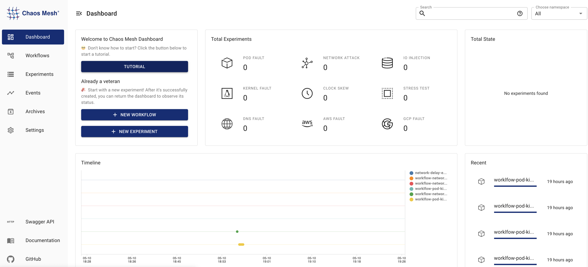

本文件描述 Chaos Mesh 的基本功能，包括[故障注入](#fault-injection)、[混沌工作流程](#chaos-workflows)、[可視化操作](#visualized-operations)和[安全保證](#security-guarantees)。

## 故障注入

故障注入是混沌實驗的核心。Chaos Mesh 涵蓋分散式系統中可能發生的各類故障，提供三種全面且細粒度的故障類型：基礎資源故障、平台故障和應用層故障。

- 基礎資源故障：
  - [PodChaos](simulate-pod-chaos-on-kubernetes.md)：模擬 Pod 故障，例如 Pod 節點重啟、Pod 持續不可用，以及特定 Pod 中的容器故障
  - [NetworkChaos](simulate-network-chaos-on-kubernetes.md)：模擬網路故障，例如網路延遲、封包遺失、封包亂序和網路分割
  - [DNSChaos](simulate-dns-chaos-on-kubernetes.md)：模擬 DNS 故障，例如 DNS 域名解析失敗或返回錯誤 IP 位址
  - [HTTPChaos](simulate-http-chaos-on-kubernetes.md)：模擬 HTTP 通訊故障，例如 HTTP 通訊延遲
  - [StressChaos](simulate-heavy-stress-on-kubernetes.md)：模擬 CPU 或記憶體資源競爭
  - [IOChaos](simulate-io-chaos-on-kubernetes.md)：模擬應用程式檔案 I/O 故障，例如 I/O 延遲、讀寫失敗
  - [TimeChaos](simulate-time-chaos-on-kubernetes.md)：模擬時間跳變異常
  - [KernelChaos](simulate-kernel-chaos-on-kubernetes.md)：模擬核心層級故障，例如應用程式記憶體分配異常

- 平台故障：
  - [AWSChaos](simulate-aws-chaos.md)：模擬 AWS 平台故障，例如 AWS 節點重啟
  - [GCPChaos](simulate-gcp-chaos.md)：模擬 GCP 平台故障，例如 GCP 節點重啟

- 應用層故障：
  - [JVMChaos](simulate-jvm-application-chaos.md)：模擬 JVM 應用程式故障，例如函數呼叫延遲

## 混沌工作流程

混沌工作流程包含一組混沌實驗和應用程式狀態檢查，讓您能在平台上完成混沌工程專案的完整流程。

混沌工作流程讓您能執行一系列混沌實驗，持續擴大爆炸半徑（包括攻擊範圍）並增加故障類型。執行工作流程後，您可透過 Chaos Mesh 輕鬆檢視應用程式當前狀態，決定是否執行後續實驗。同時為降低維護成本，您可持續更新累積混沌實驗工作流程，並將現有實驗應用於其他工作流程。

目前混沌工作流程提供以下功能：

- 編排串列混沌實驗

- 編排平行混沌實驗

- 支援檢查實驗狀態與結果

- 支援暫停混沌實驗

- 支援使用 YAML 檔案定義和管理工作流程

- 支援透過 Web UI 定義和管理工作流程

具體工作流程配置請參閱[建立 Chaos Mesh 工作流程](create-chaos-mesh-workflow.md)。

## 可視化操作

Chaos Mesh 提供 Chaos Dashboard 元件實現可視化操作，大幅簡化混沌實驗流程。您可直接透過視覺化介面管理監控實驗，例如在介面上點擊即可定義實驗範圍、指定混沌注入類型、設定排程規則並取得實驗結果。

## 安全保證

Chaos Mesh 使用 Kubernetes 原生的 [RBAC](https://kubernetes.io/docs/reference/access-authn-authz/rbac/) 功能管理權限。

您可根據實際權限需求自由建立多個角色，將角色綁定至使用者名稱服務帳號，並產生對應服務帳號的 Token。使用此 Token 登入 Dashboard 時，僅能執行該服務帳號權限範圍內的 Chaos 實驗。

此外，您可透過設定命名空間註解（annotations）來指定允許執行 Chaos 實驗的命名空間，進一步強化 Chaos 實驗的管控機制。