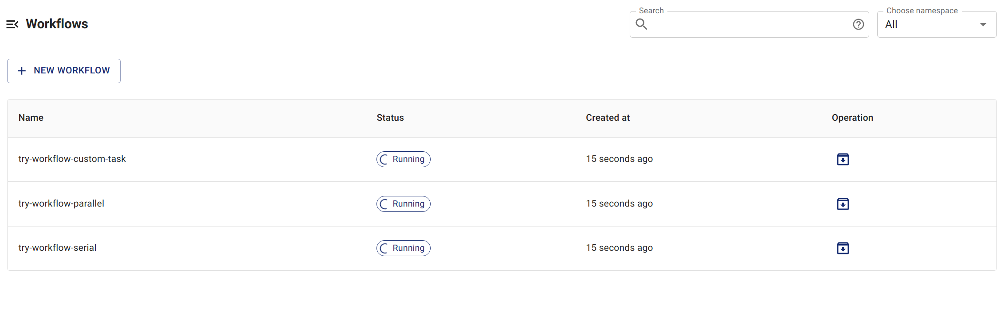
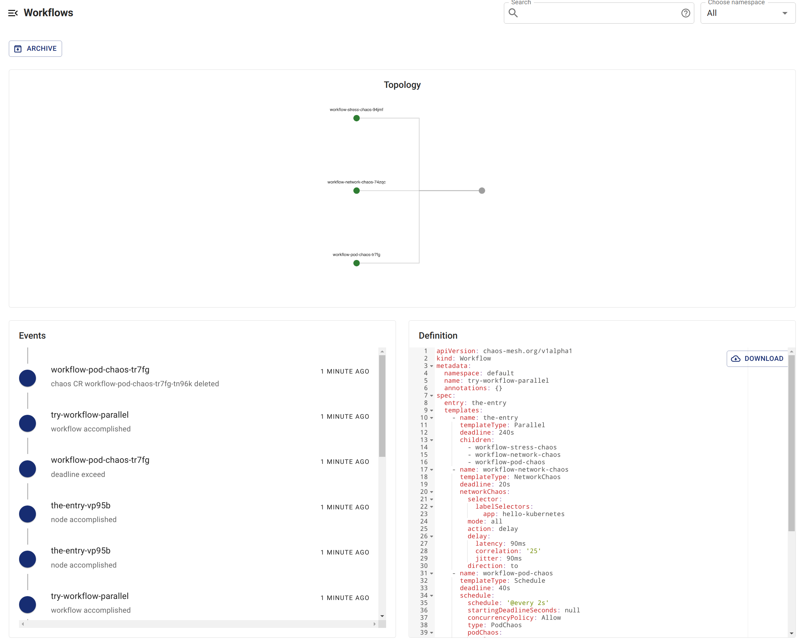

## 使用 Chaos Dashboard 檢查工作流程狀態

1. 在 Chaos Dashboard 中列出所有工作流程。

   

2. 選擇您要檢查的工作流程，查看工作流程的詳細資訊。

   

## 使用 `kubectl` 指令檢查工作流程狀態

1. 執行以下指令，列出指定命名空間中目前建立的工作流程：

   ```shell
   kubectl -n <namespace> get workflow
   ```

2. 選擇您要檢查的工作流程，並在以下指令中指定工作流程名稱。執行指令以取得該工作流程的所有工作流程節點：

   ```shell
   kubectl -n <namespace> get workflownode --selector="chaos-mesh.org/workflow=<workflow-name>"
   ```

   工作流程的步驟由這些工作流程節點的名稱表示。

3. 執行以下指令以取得指定工作流程節點的詳細狀態：

   ```shell
   kubectl -n <namespace> describe workflownode <workflow-node-name>
   ```

   輸出內容包括：目前節點的執行是否完成、其平行或序列節點的執行狀態、目前節點對應的 Chaos 實驗物件等資訊。