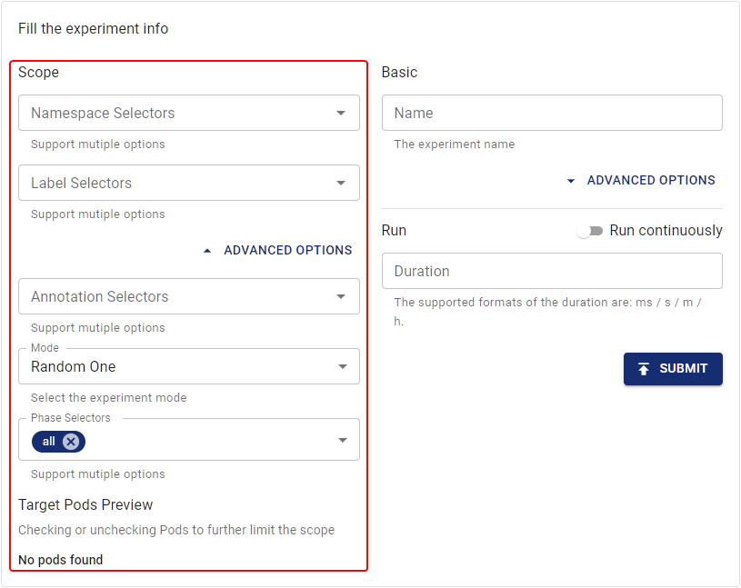

本文件說明如何定義單個 Chaos 實驗的範圍，有助於您精確控制故障的爆炸半徑。

## 實驗範圍概述

在 Chaos Mesh 中，您可以透過指定選擇器來定義單個 Chaos 實驗的範圍。

不同類型的選擇器對應不同的過濾規則。您可以在 Chaos 實驗中指定一個或多個選擇器來定義實驗範圍。若同時指定多個選擇器，實驗目標必須同時滿足所有指定選擇器的規則。

建立 Chaos 實驗時，Chaos Mesh 支援以下定義實驗範圍的方式，您可以根據需求任選其一：

- 在 YAML 設定檔中定義實驗範圍

- 在 Chaos Dashboard 上定義實驗範圍

## 在 YAML 設定檔中定義實驗範圍

本節介紹不同選擇器類型的含義與用法，並提供 YAML 檔案的設定範例。在 YAML 檔案中定義實驗範圍時，可根據範圍過濾需求指定一個或多個選擇器。

### 命名空間選擇器

- 指定實驗目標 Pod 的命名空間

- 資料類型：字串陣列

- 若此選擇器為空或未指定，Chaos Mesh 會將其設定為當前 Chaos 實驗的命名空間

使用 YAML 檔案建立實驗時，需設定選擇器。例如：

```yaml
spec:
  selector:
    namespaces:
      - 'app-ns'
```

### 標籤選擇器

- 指定實驗目標 Pod 必須具備的 [標籤](https://kubernetes.io/docs/concepts/overview/working-with-objects/labels/)

- 資料類型：鍵值對

- 若指定多個標籤，實驗目標必須具備此選擇器指定的所有標籤

使用 YAML 檔案建立實驗時，需設定選擇器。例如：

```yaml
spec:
  selector:
    labelSelectors:
      'app.kubernetes.io/component': 'tikv'
```

### 表達式選擇器

- 指定一組定義標籤規則的 [表達式](https://kubernetes.io/docs/concepts/overview/working-with-objects/labels/#resources-that-support-set-based-requirements)，用以篩選實驗目標 Pod

- 可透過此選擇器設定不滿足特定標籤的實驗目標 Pod

使用 YAML 檔案建立實驗時，需設定選擇器。例如：

```yaml
spec:
  selector:
    expressionSelectors:
      - { key: tier, operator: In, values: [cache] }
      - { key: environment, operator: NotIn, values: [dev] }
```

### 註解選擇器

- 指定實驗目標 Pod 必須具備的 [註解](https://kubernetes.io/docs/concepts/overview/working-with-objects/annotations/)

- 資料類型：鍵值對

- 若指定多個註解，實驗目標必須具備此選擇器指定的所有註解

使用 YAML 檔案建立實驗時，需設定選擇器。例如：

```yaml
spec:
  selector:
    annotationSelectors:
      'example-annotation': 'group-a'
```

### 欄位選擇器

- 指定實驗目標 Pod 的 [欄位](https://kubernetes.io/docs/concepts/overview/working-with-objects/field-selectors/)

- 資料類型：鍵值對

- 若指定多個欄位，實驗目標必須具備此選擇器設定的所有欄位

使用 YAML 檔案建立實驗時，需設定選擇器。例如：

```yaml
spec:
  selector:
    fieldSelectors:
      'metadata.name': 'my-pod'
```

### PodPhase 選擇器

- 指定實驗目標 Pod 的階段

- 資料類型：字串陣列類型。

- 支援的階段：`Pending`、`Running`、`Succeeded`、`Failed`、`Unknown`。

- 此選項預設為空，表示目標 Pod 的階段不受限制。

當使用 YAML 檔案建立實驗時，您需要配置選擇器。例如：

```yaml
spec:
  selector:
    podPhaseSelectors:
      - 'Running'
```

### 節點選擇器

- 指定實驗目標 Pod 所屬節點的[節點標籤](https://kubernetes.io/docs/tasks/configure-pod-container/assign-pods-nodes/)。

- 資料類型：鍵值對。

- 若指定多個節點標籤，實驗目標 Pod 所屬節點必須具備此選擇器指定的所有標籤。

當使用 YAML 檔案建立實驗時，您需要配置選擇器。例如：

```yaml
spec:
  selector:
    nodeSelectors:
      'node-label': 'label-one'
```

### 節點清單選擇器

- 指定實驗目標 Pod 所屬的節點。

- 資料類型：字串陣列類型。

- 目標 Pod 只能屬於配置節點清單中的單一節點。

當使用 YAML 檔案建立實驗時，您需要配置選擇器。例如：

```yaml
spec:
  selector:
    nodes:
      - node1
      - node2
```

### Pod 清單選擇器

- 指定實驗目標 `Pods` 的命名空間和清單。

- 資料類型：鍵值對。"鍵"為目標 `Pod` 的命名空間，"值"為目標 `Pod` 清單。

- 若指定此選擇器，Chaos Mesh **將忽略**其他已配置的選擇器。

當使用 YAML 檔案建立實驗時，您需要配置選擇器。例如：

```yaml
spec:
  selector:
    pods:
      tidb-cluster: # namespace of the target pods
        - basic-tidb-0
        - basic-pd-0
        - basic-tikv-0
        - basic-tikv-1
```

### 實體機器清單選擇器

- 指定實驗目標 `PhysicalMachines` 的命名空間和清單。

- 資料類型：鍵值對。"鍵"為目標 `PhysicalMachine` 的命名空間，"值"為目標 `PhysicalMachine` 清單。

- 若指定此選擇器，Chaos Mesh **將忽略**其他已配置的選擇器。

:::note

`PhysicalMachine` is a CRD (CustomResourcesDefinition) that represents a physical machine. To create `PhysicalMachine`, Chaos Mesh uses [Chaosctl](chaosctl-tool.md#generate-tls-certificates-for-chaosd).

:::

當使用 YAML 檔案建立實驗時，您需要配置選擇器。例如：

```yaml
spec:
  selector:
    physicalMachines:
      default: # namespace of the target PhysicalMachines
        - physical-machine-a
        - physical-machine-b
```

## 在 Chaos Dashboard 定義實驗範圍

若您使用 Chaos Dashboard 建立混沌實驗，可在填寫實驗資訊時配置實驗範圍。

Chaos Dashboard 目前提供以下選擇器。您可根據實驗範圍的篩選需求指定一或多個選擇器：

- 命名空間選擇器

- 標籤選擇器

- 註解選擇器

- 階段選擇器

配置選擇器時，您可於儀表板即時查看實驗目標的實際範圍，並能直接修改選擇器篩選出的目標 Pod 範圍。



## 相容性矩陣

| Type                           | Support Kubernetes | Support physical machine |
| :----------------------------- | :----------------- | :----------------------- |
| Namespace Selectors            | Yes                | Yes                      |
| Label Selectors                | Yes                | Yes                      |
| Expression Selectors           | Yes                | Yes                      |
| Annotation Selectors           | Yes                | Yes                      |
| Field Selectors                | Yes                | Yes                      |
| PodPhase Selectors             | Yes                | No                       |
| Node Selectors                 | Yes                | No                       |
| Node List Selectors            | Yes                | No                       |
| Pod List Selectors             | Yes                | No                       |
| PhysicalMachine List Selectors | No                 | Yes                      |