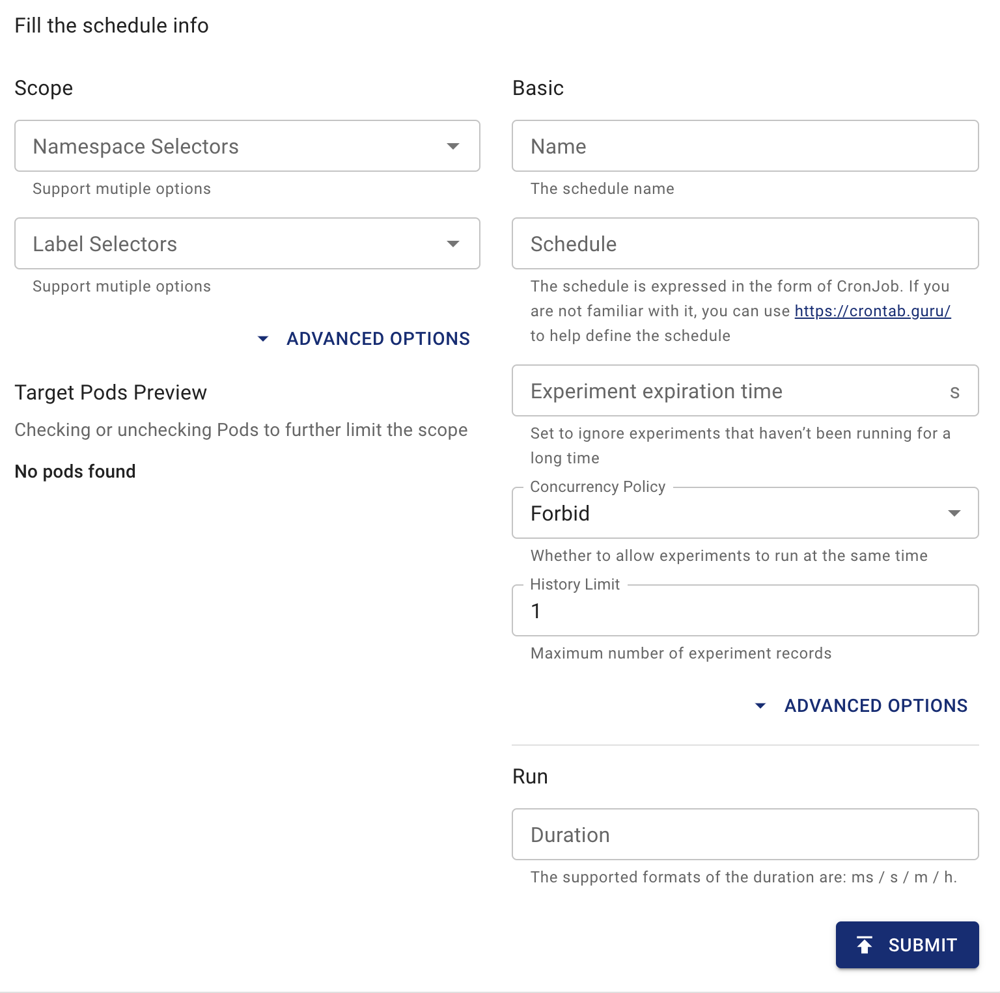

## 排程概覽

本文件說明如何使用 Chaos Mesh 建立排程任務，該任務可在固定時間（或固定時間間隔）自動建立混沌實驗。

在 Kubernetes 中，Chaos Mesh 使用 `Schedule` 來描述排程任務。

:::note

The name of a `Schedule` object should not exceed 57 characters because the created Chaos experiment will add 6 additional random characters to the end of the name.The name of the `Schedule` object with `Workflow` should not exceed 51 characters because Workflow will add 6 additional random characters to the end of the name.

:::

## 使用 YAML 檔案透過 `kubectl` 建立排程規則

例如，要在每小時的第 5 分鐘施加 100 毫秒延遲持續 12 秒，請按以下方式配置 YAML 檔案：

```yaml
apiVersion: chaos-mesh.org/v1alpha1
kind: Schedule
metadata:
  name: schedule-delay-example
spec:
  schedule: '5 * * * *'
  historyLimit: 2
  concurrencyPolicy: 'Allow'
  type: 'NetworkChaos'
  networkChaos:
    action: delay
    mode: one
    selector:
      namespaces:
        - default
      labelSelectors:
        'app': 'web-show'
    delay:
      latency: '10ms'
      correlation: '100'
      jitter: '0ms'
    duration: '12s'
```

將此 YAML 檔案儲存為 `schedule-networkchaos.yaml`，然後執行 `kubectl apply -f ./schedule-networkchaos.yaml`。

Based on this configuration, Chaos Mesh will create the following `NetworkChaos` object in the fifth minute of each hour (such as `0:05`, `1:05`...):

```yaml
apiVersion: chaos-mesh.org/v1alpha1
kind: NetworkChaos
metadata:
  name: schedule-delay-example-xxxxx
spec:
  action: delay
  mode: one
  selector:
    namespaces:
      - default
    labelSelectors:
      'app': 'web-show'
  delay:
    latency: '10ms'
    correlation: '100'
    jitter: '0ms'
  duration: '12s'
```

`Schedule` 中的欄位說明如下，大多與 Kubernetes `CronJob` 的欄位相似。您可參考 [Kubernetes CronJob 文件](https://kubernetes.io/zh/docs/concepts/workloads/controllers/cron-jobs/) 獲取更多資訊。

:::note

`schedule` 欄位的時區取決於 `chaos-controller-manager` 的時區。

:::

### `schedule` 欄位

`schedule` 欄位用於指定實驗執行時間。換言之，排程的別名就是 cron 任務：

```txt
# ┌───────────── minute (0 - 59)
# │ ┌───────────── hour (0 - 23)
# │ │ ┌───────────── day of the month (1 - 31)
# │ │ │ ┌───────────── month (1 - 12)
# │ │ │ │ ┌───────────── day of the week (0 - 6) (Sunday to Saturday; 7 is also Sunday on some systems)
# │ │ │ │ │
# │ │ │ │ │
# │ │ │ │ │
# * * * * * <command to execute>
```

> This diagram is taken from https://en.wikipedia.org/wiki/Cron.

Chaos Mesh 在內部使用 [robfig/cron/v3](https://pkg.go.dev/github.com/robfig/cron/v3) 將 `schedule` 欄位轉換為 cron 表達式。

:::tip

若需生成排程，可使用 [crontab.guru](https://crontab.guru) 等線上工具。

:::

#### 預定義排程

除常規語法外，還提供數種預定義排程。您可用以下任一預定義排程替代 cron 表達式：

| Entry                  | Description                                | Equivalent To |
| ---------------------- | ------------------------------------------ | ------------- |
| @yearly (or @annually) | Run once a year, midnight, Jan. 1st        | 0 0 1 1 \*    |
| @monthly               | Run once a month, midnight, first of month | 0 0 1 \* \*   |
| @weekly                | Run once a week, midnight between Sat/Sun  | 0 0 \* \* 0   |
| @daily (or @midnight)  | Run once a day, midnight                   | 0 0 \* \* \*  |
| @hourly                | Run once an hour, beginning of hour        | 0 \* \* \* \* |

> This table is taken from https://pkg.go.dev/github.com/robfig/cron/v3#hdr-Predefined_schedules.

#### 間隔

您亦可設定任務以固定間隔執行，從添加任務或 cron 運行時開始。支援透過以下格式配置 cron 規格：

```txt
@every <duration>
```

例如，`@every 1h30m10s` 表示排程會在 1 小時 30 分鐘 10 秒後啟動，之後按此間隔持續執行。

:::info

The content of `Intervals` is taken from https://pkg.go.dev/github.com/robfig/cron/v3#hdr-Intervals. You can refer to the official documentation for more information.

:::

### `historyLimit` 欄位

實驗結束後，對應歷史記錄不會被刪除，以便在發生錯誤時輕鬆檢索和觀察結果。`historyLimit` 設定的數字是保留任務的數量，此數量包含進行中的任務。Chaos Mesh 不會刪除運行中的任務。

當任務數量超過 `historyLimit` 設定值時，Chaos Mesh 將依序刪除最早建立的任務。若這些任務仍在執行中，則會被跳過且不會被刪除。

### `concurrencyPolicy` 欄位

此欄位可設定值為 `"Forbid"`、`"Allow"` 或 `""`。

此欄位用於指定是否允許此 `Schedule` 物件建立多個並行實驗。例如在 `schedule: * * * * *` 配置下，每分鐘都會建立一個實驗。若實驗的 `duration` 設定為 70 秒，將會同時存在多個實驗。

預設情況下，`concurrencyPolicy` 欄位設為 `Forbid`，表示不允許同時建立多個實驗。若將 `concurrencyPolicy` 欄位值設為 `Allow`，則允許同時建立多個實驗。

以下仍以延遲實驗為例進行配置：

```yaml
spec:
  schedule: '* * * * *'
  type: 'NetworkChaos'
  networkChaos:
    action: delay
    mode: one
    selector:
      namespaces:
        - default
      labelSelectors:
        'app': 'web-show'
    delay:
      latency: '10ms'
    duration: '70s'
```

基於此配置，若設定 `concurrencyPolicy: "Allow"`，則每分鐘的前 10 秒會產生 20 毫秒延遲，其餘 50 秒則維持 10 毫秒延遲。若設定 `concurrencyPolicy: "Forbid"`，則全程僅維持 10 毫秒延遲。

:::note

請注意，並非所有實驗類型都支援在同一 Pod 上執行多個實驗。詳情請參閱特定實驗類型的文件。

:::

### `startingDeadlineSeconds` 欄位

`startingDeadlineSeconds` 的預設值為 `nil`。

當 `startingDeadlineSeconds` 設為 `nil` 時，Chaos Mesh 會檢查從上次排程時間至今是否有遺漏的實驗（可能因關閉 Chaos Mesh、長期暫停 Schedule 或將 `concurrencyPolicy` 設為 `Forbid` 而發生）。

當 `startingDeadlineSeconds` 設定為大於 `0` 的值時，Chaos Mesh 會檢查當前時間回溯 `startingDeadlineSeconds` 秒內是否有遺漏的實驗。若 `startingDeadlineSeconds` 值過小，可能導致部分實驗被遺漏。例如：

```yaml
spec:
  schedule: '* * * * *'
  type: 'NetworkChaos'
  networkChaos:
    action: delay
    mode: one
    selector:
      namespaces:
        - default
      labelSelectors:
        'app': 'web-show'
    startingDeadlineSeconds: 5
    delay:
      latency: '10ms'
    duration: '70s'
```

上例中，由於 `concurrencyPolicy` 設為 `Forbid`，在每分鐘起始時禁止建立新任務。當該分鐘第 10 秒時，上個建立的混沌實驗已執行完畢。但受 `startingDeadlineSeconds` 限制及 `concurrencyPolicy` 設定影響，遺漏事件不會被補執行，且不會建立任何混沌實驗。新的混沌實驗將於下一分鐘起始時才會建立。

若未設定 `startingDeadlineSeconds`（或設為 `nil`），則全程將維持 10 毫秒延遲。這是因為當運行任務完成後，Chaos Mesh 發現先前有遺漏任務（因 `concurrencyPolicy` 設為 `Forbid`），便會立即建立新任務。

更多範例與詳細說明請參閱 [Kubernetes CronJob 文件](https://kubernetes.io/zh/docs/concepts/workloads/controllers/cron-jobs/#cron-job-limitations)。

### 定義實驗內容

要定義實驗具體內容，需在 `Schedule` 中指定兩個欄位：`type` 和 `*Chaos`。`type` 欄位用於指定實驗類型，`*Chaos` 欄位則描述實驗內容。通常 `type` 欄位採用大駝峰命名法（如：`NetworkChaos`、`PodChaos`、`IOChaos`），而 `*Chaos` 的鍵名採用小駝峰命名法（如：`networkChaos`、`podChaos`、`ioChaos`）。`*Chaos` 的鍵名即為對應實驗類型的 `spec` 規範，詳情請參閱特定實驗類型的文件。

## 使用 Chaos Dashboard 建立排程規則

1. 開啟 Chaos Dashboard，在頁面上點擊 **新增實驗** 以建立新實驗。

   

2. 選擇並填寫實驗的具體細節。

   

3. 填寫包含排程週期與並行策略的資訊。

   

4. 提交實驗資訊。

### 暫停排程任務

與 `CronJob` 不同，暫停 `Schedule` 不僅會阻止建立新實驗，還會暫停已建立的實驗。

If you do not want to create a Chaos experiment as a scheduled task for now, you need to add the `experiment.chaos-mesh.org/pause=true` annotation to the `Schedule` object. You can add the annotation using the `kubectl` command:

```bash
kubectl annotate -n $NAMESPACE schedule $NAME experiment.chaos-mesh.org/pause=true
```

命令中 `$NAMESPACE` 為命名空間，`$NAME` 為 `Schedule` 名稱。成功結果返回如下：

```bash
schedule/$NAME annotated
```

若需取消暫停任務，可使用以下命令移除註解：

```bash
kubectl annotate -n $NAMESPACE schedule $NAME experiment.chaos-mesh.org/pause-
```

命令中 `$NAMESPACE` 為命名空間，`$NAME` 為 `Schedule` 名稱。成功結果返回如下：

```bash
schedule/$NAME annotated
```