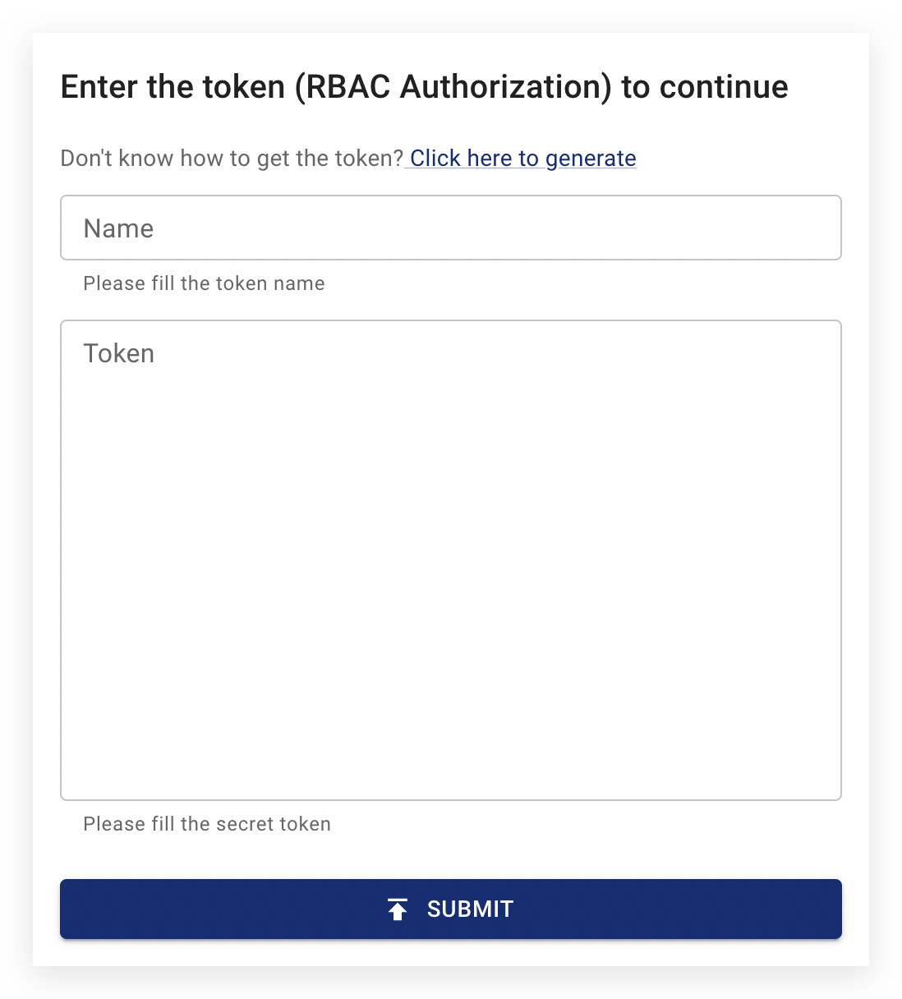

import PickHelmVersion from '@site/src/components/PickHelmVersion'

本文件說明如何在 Chaos Mesh 中管理使用者權限，包括建立具備不同角色的使用者帳戶、將權限綁定至使用者帳戶、管理權杖，以及啟用或停用權限驗證。

Chaos Mesh uses [RBAC Authorization](https://kubernetes.io/docs/reference/access-authn-authz/rbac/) to manage user permissions. To create, view and manage chaos experiments, users must have the appropriate permissions in the `apiGroups` of `chaos-mesh.org` to refer the resources of chaos experiments.

:::caution

Chaos Mesh 允許您停用權限驗證，詳見[啟用或停用權限驗證](#enable-or-disable-permission-authentication)了解停用方式。

**請注意，我們不建議在生產環境中停用權限驗證。**

:::

## 建立使用者帳戶並綁定權限

您可使用 Chaos Dashboard 協助建立使用者帳戶並綁定權限。存取儀表板時會顯示登入視窗，點擊 **點擊此處產生** 連結：



點擊連結後將顯示權杖產生器，如下所示：


建立使用者帳戶並綁定權限的步驟如下：

### 選擇權限範圍

若要賦予帳戶叢集內所有混沌實驗的相應權限，請勾選 **叢集範圍** 核取方塊。若在 **命名空間** 下拉選單指定命名空間，該帳戶僅具備指定命名空間中的權限。

總括而言有兩種選項：

- `Cluster scoped`：帳戶具備叢集內所有混沌實驗的權限。

- `Namespace scoped`：帳戶具備指定命名空間中所有混沌實驗的權限。

### 選擇使用者角色

目前 Chaos Mesh 提供以下使用者角色：

- `Manager`：具備建立、檢視、更新及刪除混沌實驗的全部權限。

- `Viewer`：僅具備檢視混沌實驗的權限。

### 產生權限

定義權限範圍和使用者角色後，儀表板將在權杖產生器中顯示對應的 RBAC 設定。例如具備 `default` 命名空間的管理者權限設定如下：

```yaml
kind: ServiceAccount
apiVersion: v1
metadata:
  namespace: default
  name: account-default-manager-vfmot

---
kind: Role
apiVersion: rbac.authorization.k8s.io/v1
metadata:
  namespace: default
  name: role-default-manager-vfmot
rules:
  - apiGroups: ['']
    resources: ['pods', 'namespaces']
    verbs: ['get', 'watch', 'list']
  - apiGroups:
      - chaos-mesh.org
    resources: ['*']
    verbs: ['get', 'list', 'watch', 'create', 'delete', 'patch', 'update']

---
apiVersion: rbac.authorization.k8s.io/v1
kind: RoleBinding
metadata:
  name: bind-default-manager-vfmot
  namespace: default
subjects:
  - kind: ServiceAccount
    name: account-default-manager-vfmot
    namespace: default
roleRef:
  kind: Role
  name: role-default-manager-vfmot
  apiGroup: rbac.authorization.k8s.io
```

點擊設定區塊右上角的 **COPY** 複製 RBAC 設定，並將內容儲存為本機檔案 `rbac.yaml`。

### 建立使用者帳戶並綁定權限

在終端機執行以下命令：

```bash
kubectl apply -f rbac.yaml
```

:::note

您需確保執行 `kubectl` 的本機使用者具備叢集權限，才能為其他使用者建立帳戶、綁定權限及產生權杖。

:::

### 取得權杖

:::info

Kubernetes v1.22 之前版本會自動建立存取 Kubernetes API 的長期憑證。較新版本中，您必須手動建立服務帳戶權杖 Secret。

詳見[手動為 ServiceAccount 建立 API 權杖](https://kubernetes.io/docs/tasks/configure-pod-container/configure-service-account/#manually-create-an-api-token-for-a-serviceaccount)。

:::

複製權杖產生器中第三步顯示的命令，在終端機執行。以下為範例命令：

```bash
kubectl describe -n default secrets account-default-manager-vfmot
```

輸出如下：

```log
Name:         account-default-manager-vfmot-token-n4tg8
Namespace:    default
Labels:       <none>
Annotations:  kubernetes.io/service-account.name: account-default-manager-vfmot
              kubernetes.io/service-account.uid: b71b3bf4-cd5e-4efb-8bf6-ff9a55fd7e07

Type:  kubernetes.io/service-account-token

Data
====
ca.crt:     1111 bytes
namespace:  7 bytes
token:      eyJhbG...
```

複製底部的權杖，用於後續登入步驟。

## 使用您建立的用戶帳號登入 Chaos Dashboard

**關閉** Token 產生器。在 **Token** 欄位中輸入您上一步取得的 token，並在 **Name** 欄位中輸入一個有意義的名稱。建議採用權限範圍和使用者角色的組合命名，例如 `default-manager`。完成這兩個欄位後，點擊 **Submit** 登入：


:::info

如果您尚未部署 Chaos Dashboard，也可以自行產生 RBAC 設定，然後使用 `kubectl` 建立使用者帳號並綁定權限。

:::

## 登出 Chaos Dashboard

如需更換 token，請點擊儀表板左側導覽列的 **Settings**：


在頁面頂部您會看到 **Logout** 按鈕，點擊即可登出目前帳號。

## 常見問題

### 啟用或停用權限驗證

使用 Helm 安裝 Chaos Mesh 時，預設啟用權限驗證。對於生產環境等高安全性場景，建議保持啟用狀態。若僅需快速建立混沌實驗進行測試，可在 Helm 指令中設定 `--set dashboard.securityMode=false` 停用驗證，指令範例如下：

<PickHelmVersion>
{`helm upgrade chaos-mesh chaos-mesh/chaos-mesh --namespace=chaos-mesh --version latest --set dashboard.securityMode=false`}
</PickHelmVersion>

如需重新啟用權限驗證，請在 Helm 指令中設定 `--set dashboard.securityMode=true`。