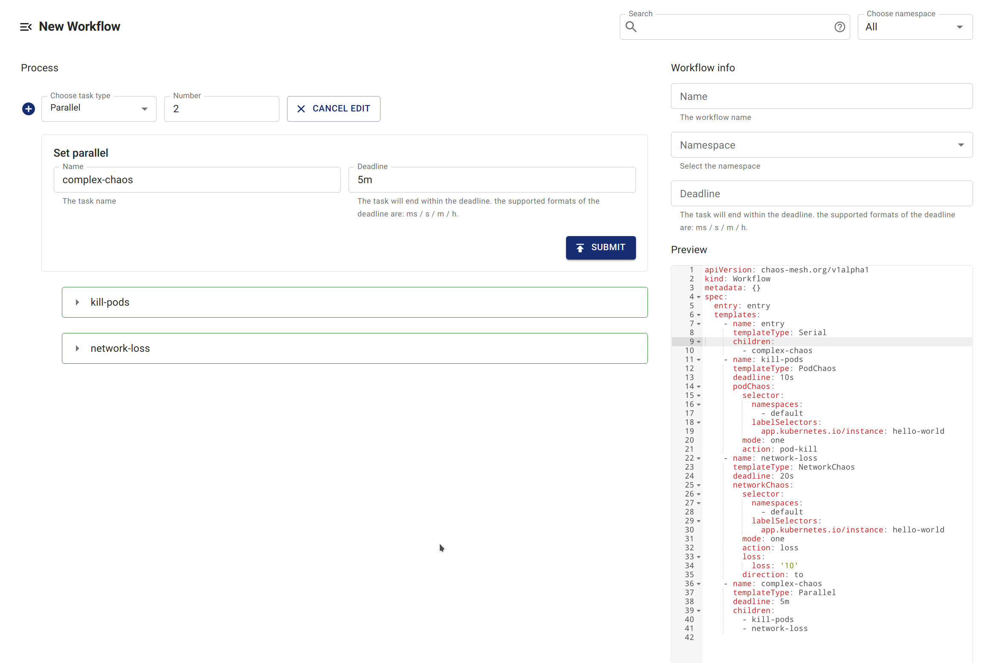

Chaos Mesh 工作流程提供兩種實驗排程方式：序列執行與平行執行。您可以根據需求配置並排程多個實驗。

- 若需依序執行多個混沌實驗，請使用序列節點。

- 若需同時執行多個混沌實驗，請使用平行節點。

Chaos Mesh 在設計序列節點與平行節點時採用[組合模式](https://en.wikipedia.org/wiki/Composite_pattern)。該模式可容納不同類型的多個節點，並以特定模式執行組合節點。這也意味著您可以嵌套序列節點與平行節點，實現複雜的排程邏輯。

## 序列實驗

在工作流程中建立 `templates` 時，使用 `templateType: Serial` 宣告序列節點。

序列節點的另一必要欄位是 `children`，其類型為 `[]string`，值為其他 `template` 的名稱。例如：

```yaml
apiVersion: chaos-mesh.org/v1alpha1
kind: Workflow
metadata:
  name: try-workflow-serial
spec:
  entry: serial-of-3-node
  templates:
    - name: serial-of-3-node
      templateType: Serial
      deadline: 240s
      children:
        - workflow-stress-chaos
        - suspending
        - workflow-network-chaos
    - name: suspending
      templateType: Suspend
      deadline: 10s
    - name: workflow-network-chaos
      templateType: NetworkChaos
      deadline: 20s
      networkChaos:
        direction: to
        action: delay
        mode: all
        selector:
          labelSelectors:
            'app': 'hello-kubernetes'
        delay:
          latency: '90ms'
          correlation: '25'
          jitter: '90ms'
    - name: workflow-stress-chaos
      templateType: StressChaos
      deadline: 20s
      stressChaos:
        mode: one
        selector:
          labelSelectors:
            'app': 'hello-kubernetes'
        stressors:
          cpu:
            workers: 1
            load: 20
            options: ['--cpu 1', '--timeout 600']
```

上述指令宣告名為 `serial-of-3-node` 的序列節點，表示 Chaos Mesh 將依序執行 `workflow-stress-chaos`、`suspending` 和 `workflow-network-chaos`。所有任務完成後，序列節點標記為完成狀態。

Chaos Mesh 執行序列節點時，`children` 宣告的任務將順序執行，確保同一時間僅有一個任務運行。

序列節點中的 `deadline` 為可選欄位，用於限制整個序列過程的最長持續時間。若超過時限，子節點將被終止且未執行的節點不再執行。若所有子節點在 `deadline` 時限前完成工作，序列節點立即標記為完成，不受 `deadline` 影響。

## 平行實驗

在工作流程中建立 `templates` 時，使用 `templateType: Parallel` 宣告平行節點。

平行節點的另一必要欄位是 `children`，其類型為 `[]string`，值為其他 `template` 的名稱。例如：

```yaml
apiVersion: chaos-mesh.org/v1alpha1
kind: Workflow
metadata:
  name: try-workflow-parallel
spec:
  entry: parallel-of-2-chaos
  templates:
    - name: parallel-of-2-chaos
      templateType: Parallel
      deadline: 240s
      children:
        - workflow-stress-chaos
        - workflow-network-chaos
    - name: workflow-network-chaos
      templateType: NetworkChaos
      deadline: 20s
      networkChaos:
        direction: to
        action: delay
        mode: all
        selector:
          labelSelectors:
            'app': 'hello-kubernetes'
        delay:
          latency: '90ms'
          correlation: '25'
          jitter: '90ms'
    - name: workflow-stress-chaos
      templateType: StressChaos
      deadline: 20s
      stressChaos:
        mode: one
        selector:
          labelSelectors:
            'app': 'hello-kubernetes'
        stressors:
          cpu:
            workers: 1
            load: 20
            options: ['--cpu 1', '--timeout 600']
```

上述指令宣告名為 `parallel-of-2-chaos` 的平行節點，表示 Chaos Mesh 將同時執行 `workflow-stress-chaos` 和 `workflow-network-chaos`。所有任務完成後，平行節點標記為完成狀態。

Chaos Mesh 執行平行節點時，`children` 宣告的所有任務將同時執行。

類似序列節點，平行節點也提供可選的 `deadline` 欄位，用於限制整個平行過程的最長執行時間。若超過時限，子節點將被終止。若所有子節點在 `deadline` 時限前完成工作，平行節點立即標記為完成，不受 `deadline` 影響。

## 透過 Chaos Dashboard 建立含序列/平行節點的工作流程

### 建立序列節點

Chaos Dashboard 預設建立名為 `entry` 的序列節點。因此透過 Dashboard 建立含序列節點的工作流程時，預設會在 `entry` 下建立。


### 建立平行節點

您可以建立平行節點 `Parallel`，並在 `Parallel` 下建立子節點。



### 嵌套序列與平行節點

您可以透過嵌套序列節點與平行節點，建立更複雜的流程。

