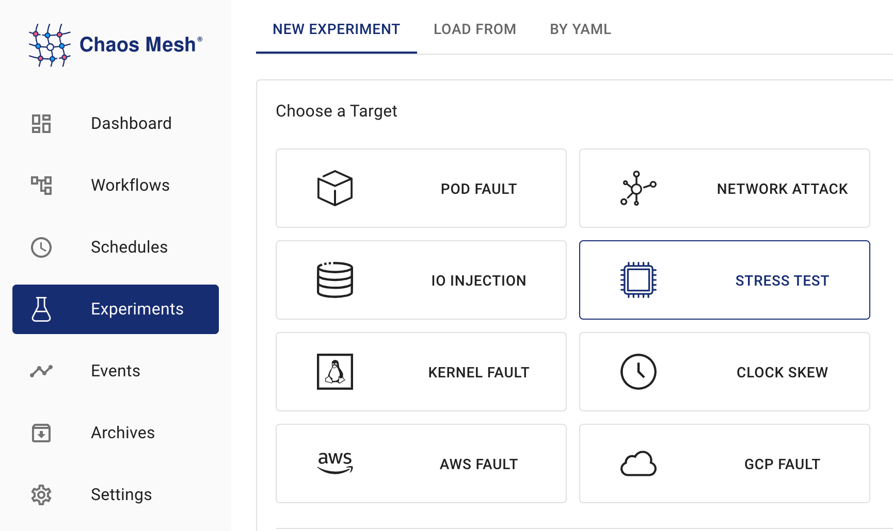

## StressChaos 簡介

Chaos Mesh 提供 StressChaos 實驗來模擬容器內的壓力場景。本文檔介紹如何建立 StressChaos 實驗以及如何準備對應的設定檔。

您可以使用 Chaos Dashboard 或 YAML 設定檔來建立實驗。

## 使用 Chaos Dashboard 建立實驗

1. 開啟 Chaos Dashboard，並在頁面上點選 **新建實驗** 以建立新實驗：

   

2. 在 **選擇目標** 區域中，選擇 **壓力測試** 並填寫實驗資訊。有關具體設定欄位，請參閱 [設定說明](#fields description) 中的描述。

   

3. 填寫實驗資訊，並指定實驗範圍和排程的實驗持續時間：

   

4. 提交實驗資訊。

## 使用 YAML 檔案建立實驗

1. 將實驗設定寫入 YAML 設定檔。在以下範例中，使用 `memory-stress.yaml` 檔案。

   ```yaml
   apiVersion: chaos-mesh.org/v1alpha1
   kind: StressChaos
   metadata:
     name: memory-stress-example
     namespace: chaos-mesh
   spec:
     mode: one
     selector:
       labelSelectors:
         'app': 'app1'
     stressors:
       memory:
         workers: 4
         size: '256MB'
   ```

   此實驗設定將在選定的容器中建立一個程序，持續分配並讀寫記憶體，最多佔用 256MB 的記憶體。

2. 準備好設定檔後，使用 `kubectl` 建立實驗：

   ```bash
   kubectl apply -f memory-stress.yaml
   ```

### 欄位說明

YAML 設定檔中的欄位說明如下表所示：

| Parameter | Type | Description | Default value | Required | Example |
| --- | --- | --- | --- | --- | --- |
| duration | string | Specifies the duration of the experiment. | None | Yes | `30s` |
| stressors | [Stressors](#stressors) | Specifies the stress of CPU or memory | None | No |  |
| stressngStressors | string | Specifies the stres-ng parameter to reach richer stress injection | None | No | `--clone 2` |
| mode | string | Specifies the mode of the experiment. The mode options include `one` (selecting a random Pod), `all` (selecting all eligible Pods), `fixed` (selecting a specified number of eligible Pods), `fixed-percent` (selecting a specified percentage of Pods from the eligible Pods), and `random-max-percent` (selecting the maximum percentage of Pods from the eligible Pods). | None | Yes | `one` |
| value | string | Provides a parameter for the `mode` configuration, depending on `mode`.For example, when `mode` is set to `fixed-percent`, `value` specifies the percentage of Pods. | None | No | 1 |
| containerNames | []string | Specifies the name of the container into which the fault is injected. | None | No | `["nginx"]` |
| selector | struct | Specifies the target Pod. For details, refer to [Define the Scope of Chaos Experiments](./define-chaos-experiment-scope.md). | None | Yes |  |

#### 壓力源

| Parameter | Type                              | Description                 | Default value | Required | Example |
| --------- | --------------------------------- | --------------------------- | ------------- | -------- | ------- |
| memory    | [MemoryStressor](#memorystressor) | Specifies the memory stress | None          | No       |         |
| cpu       | [CPUStressor](#cpustressor)       | Specifies the CPU stress    | None          | No       |         |

##### 記憶體壓力源

| Parameter | Type | Description | Default value | Required | Example |
| --- | --- | --- | --- | --- | --- |
| workers | int | Specifies the number of threads that apply memory stress |  | No | `1` |
| size | string | Specifies the memory size to be occupied or a percentage of the total memory size. The final sum of the occupied memory size is `size`. |  | No | `256MB / 25%` |
| time | string | Specifies the time to reach the memory `size`. The growth model is a linear model. |  | No | `10min` |
| oomScoreAdj | int | Specifies the [oom_score_adj](https://man7.org/linux/man-pages/man5/proc.5.html) of the stress process. |  | No | `-1000` |

:::note

為避免 `stress-ng` 的讀寫壓力導致高 CPU 負載，Chaos Mesh 使用 [memStress](https://github.com/chaos-mesh/memStress) 來模擬記憶體壓力。這是因為 memStress 通過消耗實際記憶體來模擬記憶體壓力，而不是對記憶體施加讀寫壓力。

:::

##### CPU 壓力源

| Parameter | Type | Description | Default value | Required | Example |
| --- | --- | --- | --- | --- | --- |
| workers | int | Specifies the number of threads that apply CPU stress |  | Yes | `1` |
| load | int | Specifies the percentage of CPU occupied. `0` means that no additional CPU is added, and `100` refers to full load. The final sum of CPU load is `workers * load`. |  | No | `50` |