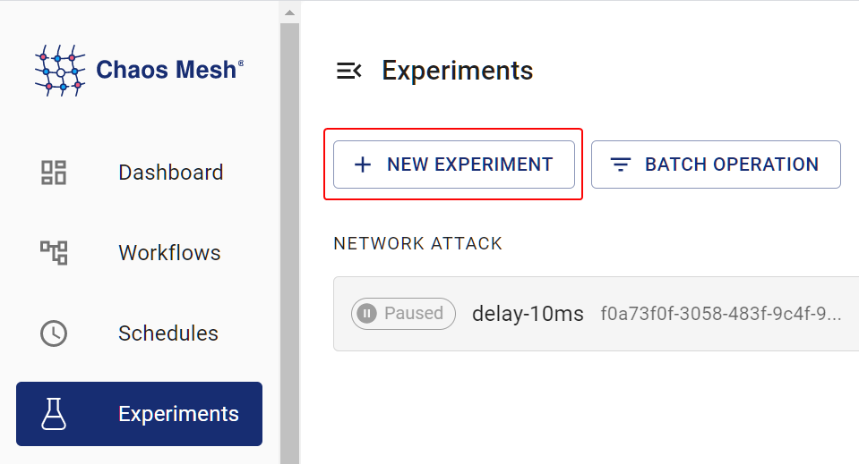

Chaos Mesh 透過 [Byteman](https://github.com/chaos-mesh/byteman) 模擬 JVM 應用程式的故障。支援的故障類型如下：

- 拋出自訂例外

- 觸發垃圾回收

- 增加方法延遲

- 修改方法返回值

- 透過設定 Byteman 配置檔案觸發故障

- 增加 JVM 壓力

本文檔說明如何使用 Chaos Mesh 建立上述故障類型的 JVM 實驗。

:::note

您的 Linux 核心必須是 v4.1 或更高版本。

:::

## 使用 Chaos Dashboard 建立實驗

1. 開啟 Chaos Dashboard，點選頁面上的 **NEW EXPERIMENT** 建立新實驗。

   

2. In the **Choose a Target** area, choose **JVM FAULT**, and select a specific behavior, such as **`RETURN`**. Then, fill out the detailed configurations.

   

   For information about how to fill out the configurations, refer to [Field Description] (#field-description).

3. 填寫實驗資訊，指定實驗範圍和排程實驗時間。

   

4. 提交實驗資訊。

## 使用 YAML 檔案建立實驗

以下範例展示 JVMChaos 的用法與效果，透過指定方法返回值示範。相關 YAML 檔案可在 [examples/jvm](https://github.com/chaos-mesh/chaos-mesh/tree/master/examples/jvm) 找到，預設工作目錄同為 `examples/jvm`。Chaos Mesh 預設安裝命名空間為 `chaos-mesh`。

### 步驟 1. 建立目標應用程式

[Helloworld](https://github.com/WangXiangUSTC/byteman-example/tree/main/example.helloworld) 是簡單的 Java 應用程式，本節將其作為待測目標應用程式。目標應用程式定義於 `example/jvm/app.yaml`：

```yaml
apiVersion: v1
kind: Pod
metadata:
  name: helloworld
  namespace: helloworld
spec:
  containers:
    - name: helloworld
      # source code: https://github.com/WangXiangUSTC/byteman-example/tree/main/example.helloworld
      # this application will print log like this below:
      # 0. Hello World
      # 1. Hello World
      # ...
      image: xiang13225080/helloworld:v1.0
      imagePullPolicy: IfNotPresent
```

1. 建立目標應用程式的命名空間：

   ```shell
   kubectl create namespace helloworld
   ```

2. 建立應用程式 Pod：

   ```shell
   kubectl apply -f app.yaml
   ```

3. Execute `kubectl -n helloworld get pods`, and you are expected to find a pod named `helloworld` in the `helloworld` namespace.

   ```shell
   kubectl -n helloworld get pods
   ```

   The result is as follows:

   ```text
   kubectl get pods -n helloworld
   NAME         READY   STATUS    RESTARTS   AGE
   helloworld   1/1     Running   0          2m
   ```

   After the `READY` column turns to `1/1`, you can proceed to the next step.

### 步驟 2. 觀察注入故障前的應用行為

您可觀察 `helloworld` 應用程式在注入故障前的行為，例如：

```shell
kubectl -n helloworld logs -f helloworld
```

結果如下：

```shell
0. Hello World
1. Hello World
2. Hello World
3. Hello World
4. Hello World
5. Hello World
```

可見 `helloworld` 每秒輸出一行 `Hello World`，且每行數字依序遞增。

### 步驟 3. 注入 JVMChaos 並驗證

1. 帶有指定返回值的 JVMChaos 範例如下：

   ```yaml
   apiVersion: chaos-mesh.org/v1alpha1
   kind: JVMChaos
   metadata:
     name: return
     namespace: helloworld
   spec:
     action: return
     class: Main
     method: getnum
     value: '9999'
     mode: all
     selector:
       namespaces:
         - helloworld
   ```

   JVMChaos 將 `getnum` 方法的返回值更改為數字 `9999`，這意味著 `helloworld` 輸出中每一行的數字都被設定為 `9999`。

2. 注入帶有指定值的 JVMChaos：

   ```shell
   kubectl apply -f ./jvm-return-example.yaml
   ```

3. 檢查 `helloworld` 的最新日誌：

   ```shell
   kubectl -n helloworld logs -f helloworld
   ```

   日誌如下：

   ```shell
   Rule.execute called for return_0:0
   return execute
   caught ReturnException
   9999. Hello World
   ```

## 欄位說明

| Parameter | Type | Description | Default value | Required | Example |
| --- | --- | --- | --- | --- | --- |
| `action` | string | Indicates the specific fault type. The available fault types include `latency`, `return`, `exception`, `stress`, `gc`, and `ruleData`. | None | Yes | return |
| `mode` | string | Indicates how to select Pod. The supported modes include `one`, `all`, `fixed`, `fixed-percent`, and `random-max-percent`. | None | Yes | `one` |

不同 `action` 值的含義如下：

| Value | Meaning |
| --- | --- |
| `latency` | Increase method latency |
| `return` | Modify return values of a method |
| `exception` | Throw custom exceptions |
| `stress` | Increase CPU usage of Java process, or cause memory overflow (support heap overflow and stack overflow) |
| `gc` | Trigger garbage collection |
| `ruleData` | Trigger faults by setting Byteman configuration files |

對於不同的 `action` 值，可以填入不同的配置項。

### `latency` 的參數

| Parameter | Type | Description | Required |
| --- | --- | --- | --- |
| `class` | string | The name of the Java class | Yes |
| `method` | string | The name of the method | Yes |
| `latency` | int | The duration of increasing method latency. The unit is millisecond. | Yes |
| `port` | int | The port ID attached to the Java process agent. The faults are injected into the Java process through this ID. | No |

### `return` 的參數

| Parameter | Type | Description | Required |
| --- | --- | --- | --- |
| `class` | string | The name of the Java class | Yes |
| `method` | string | The name of the method | Yes |
| `value` | string | Specifies the return value of the method. Currently, the item can be numeric and string types. If the item (return value) is string, double quotes are required, like "chaos". | Yes |
| `port` | int | The port ID attached to the Java process agent. The faults are injected into the Java process through this ID. | No |

### `exception` 的參數

| Parameter | Type | Description | Required |
| --- | --- | --- | --- |
| `class` | string | The name of the Java class | Yes |
| `method` | string | The name of the method | Yes |
| `exception` | string | The thrown custom exception, such as 'java.io.IOException("BOOM")'. | Yes |
| `port` | int | The port ID attached to the Java process agent. The faults are injected into the Java process through this ID. | No |

### `stress` 的參數

| Parameter | Type | Description | Required |
| --- | --- | --- | --- |
| `cpuCount` | int | The number of CPU cores used for increasing CPU stress. You must configure one item between `cpu-count` and `mem-type`. | No |
| `memType` | string | The type of OOM. Currently, both 'stack' and 'heap' OOM types are supported. You must configure one item between `cpu-count` and `mem-type`. | No |
| `port` | int | The port ID attached to the Java process agent. The faults are injected into the Java process through this ID. | No |

### `gc` 的參數

| Parameter | Type | Description | Required |
| --- | --- | --- | --- |
| `port` | int | The port ID attached to the Java process agent. The faults are injected into the Java process through this ID. | No |

### `ruleData` 的參數

| Parameter | Type | Description | Required |
| --- | --- | --- | --- |
| `ruleData` | string | Specifies the Byteman configuration data | Yes |
| `port` | int | The port ID attached to the Java process agent. The faults are injected into the Java process through this ID. | No |

在撰寫規則設定檔時，請考慮特定的 Java 程式和 [byteman-rule-language](https://downloads.jboss.org/byteman/4.0.16/byteman-programmers-guide.html#the-byteman-rule-language)。例如：

```txt
RULE modify return value
CLASS Main
METHOD getnum
AT ENTRY
IF true
DO
    return 9999
ENDRULE
```

您需要將設定檔中的換行符轉義為換行字元 "\n"，並使用轉義後的文字作為 "rule-data" 的值，如下所示：

```txt
\nRULE modify return value\nCLASS Main\nMETHOD getnum\nAT ENTRY\nIF true\nDO return 9999\nENDRULE\n"
```