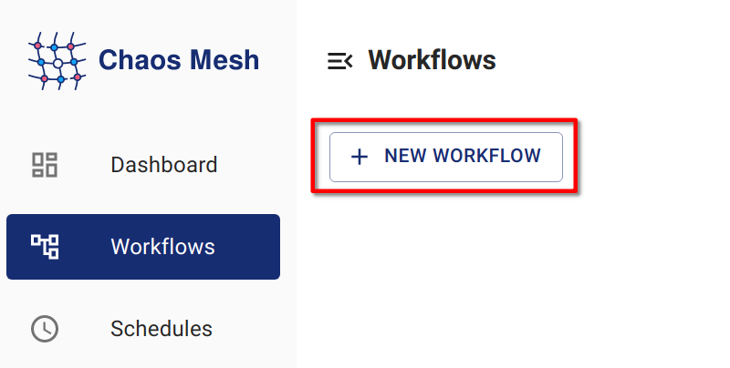
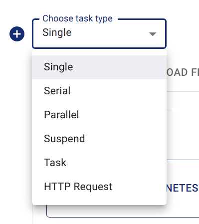

## Chaos Mesh 工作流程介紹

當您使用 Chaos Mesh 模擬真實系統故障時，持續驗證始終是需求。您可能希望在 Chaos Mesh 平台上建立一系列故障，而非執行單個的混沌注入。

為滿足此需求，Chaos Mesh 提供了 Chaos Mesh 工作流程，這是一個內建的工作流程引擎。透過此引擎，您可以串行或並行執行不同的混沌實驗，以模擬生產級別的錯誤。

目前，Chaos Mesh 工作流程支援以下功能：

- 串行編排

- 並行編排

- 自訂任務

- 條件分支

典型使用場景：

- 使用並行編排注入多個 NetworkChaos 故障，模擬複雜的網路環境

- 使用串行編排執行健康檢查，並透過條件分支判斷是否執行後續步驟

Chaos Mesh 工作流程的設計在某種程度上受到 Argo Workflows 的啟發。若您熟悉 Argo Workflows，也能快速上手 Chaos Mesh 工作流程。

更多工作流程範例可在 [Chaos Mesh GitHub 儲存庫](https://github.com/chaos-mesh/chaos-mesh/tree/master/examples/workflow) 中找到。

## 使用 Chaos Dashboard 建立工作流程

### 步驟 1：開啟 Chaos Dashboard

點擊 **新工作流程**。



### 步驟 2：設定工作流程的基本資訊


### 步驟 3：配置工作流程的節點

1. 根據需求在**選擇任務類型**下選擇選項

   本範例選擇「單一」類型作為任務類型

   :::note

   Chaos Dashboard 會自動建立名為 "entry" 的串行節點作為工作流程進入點

   :::

   

2. 填寫實驗資訊

   配置方式與建立常規混沌實驗相同。例如可設定類型為 "POD KILL" 的 "PodChaos"，命名為 `kill-nginx`

   

### 步驟 4：提交工作流程

可透過**預覽**檢查工作流程定義，再點擊**提交工作流程**建立工作流程


## 使用 YAML 檔案與 `kubectl` 建立工作流程

與各類混沌物件類似，工作流程在 Kubernetes 叢集中以 CRD 形式存在。您可使用 `kubectl create -f <workflow.yaml>` 建立 Chaos Mesh 工作流程。以下是建立工作流程的指令範例。使用本機 YAML 檔案建立：

```shell
kubectl create -f <workflow.yaml>
```

使用網路上的 YAML 檔案建立：

```shell
kubectl create -f https://raw.githubusercontent.com/chaos-mesh/chaos-mesh/master/examples/workflow/serial.yaml
```

以下是簡單的工作流程 YAML 檔案定義範例。此工作流程中注入了 `StressChaos`、`NetworkChaos` 和 `PodChaos`：

```yaml
apiVersion: chaos-mesh.org/v1alpha1
kind: Workflow
metadata:
  name: try-workflow-parallel
spec:
  entry: the-entry
  templates:
    - name: the-entry
      templateType: Parallel
      deadline: 240s
      children:
        - workflow-stress-chaos
        - workflow-network-chaos
        - workflow-pod-chaos-schedule
    - name: workflow-network-chaos
      templateType: NetworkChaos
      deadline: 20s
      networkChaos:
        direction: to
        action: delay
        mode: all
        selector:
          labelSelectors:
            'app': 'hello-kubernetes'
        delay:
          latency: '90ms'
          correlation: '25'
          jitter: '90ms'
    - name: workflow-pod-chaos-schedule
      templateType: Schedule
      deadline: 40s
      schedule:
        schedule: '@every 2s'
        type: 'PodChaos'
        podChaos:
          action: pod-kill
          mode: one
          selector:
            labelSelectors:
              'app': 'hello-kubernetes'
    - name: workflow-stress-chaos
      templateType: StressChaos
      deadline: 20s
      stressChaos:
        mode: one
        selector:
          labelSelectors:
            'app': 'hello-kubernetes'
        stressors:
          cpu:
            workers: 1
            load: 20
            options: ['--cpu 1', '--timeout 600']
```

在上述 YAML 範本中，`templates` 欄位定義實驗步驟，`entry` 欄位定義工作流程執行時的進入點。

`templates` 中的每個元素代表一個工作流程步驟，例如：

```yaml
name: the-entry
templateType: Parallel
deadline: 240s
children:
  - workflow-stress-chaos
  - workflow-network-chaos
  - workflow-pod-chaos
```

`templateType: Parallel` 表示節點類型為並行。`deadline: 240s` 表示此節點上的所有並行實驗需在 240 秒內完成，否則實驗將超時。`children` 表示要並行執行的其他模板名稱。

例如：

```yaml
name: workflow-pod-chaos
templateType: PodChaos
deadline: 40s
podChaos:
  action: pod-kill
  mode: one
  selector:
    labelSelectors:
      'app': 'hello-kubernetes'
```

`templateType: PodChaos` 表示節點類型為 PodChaos 實驗。`deadline: 40s` 表示當前混沌實驗持續 40 秒。`podChaos` 是 PodChaos 實驗的定義。

透過 YAML 檔案和 `kubectl` 建立工作流程非常靈活。您可以嵌套並行或串行編排來宣告複雜流程，甚至將編排與條件分支結合以實現循環效果。

## 欄位說明

### 工作流程欄位說明

| Parameter | Type | Description | Default value | Required | Example |
| --- | --- | --- | --- | --- | --- |
| entry | string | Declares the entry of the workflow. Its value is a name of a template. | None | Yes |  |
| templates | []Template | Declares the behavior of each step executable in the workflow. See [Template field description](#template-field-description) for details. | None | Yes |  |

### 模板欄位說明

| Parameter | Type | Description | Default value | Required | Example |
| --- | --- | --- | --- | --- | --- |
| name | string | The name of the template, which needs to meet the DNS-1123 requirements. | None | Yes | any-name |
| type | string | Type of template. Value options are Task, Serial, Parallel, Suspend, Schedule, AWSChaos, DNSChaos, GCPChaos, HTTPChaos, IOChaos, JVMChaos, KernelChaos, NetworkChaos, PodChaos, StressChaos, and TimeChaos, StatusCheck. | None | Yes | PodChaos |
| deadline | string | The duration of the template. | None | No | '5m30s' |
| children | []string | Declares the subtasks under this template. You need to configure this field when the type is `Serial` or `Parallel`. | None | No | ["any-chaos-1", "another-serial-2", "any-shcedue"] |
| task | Task | Configures the customized task. You need to configure this field when the type is `Task`. See the [Task field description](#task-field-description) for details. | None | No |  |
| conditionalBranches | []ConditionalBranch | Configures the conditional branch which executes after customized task. You need to configure this field when the type is `Task`. See the [Conditional branch field description](#conditionalbranch-field-description) for details. | None | No |  |
| awsChaos | object | Configures AWSChaos. You need to configure this field when the type is `AWSChaos`. See the [Simulate AWS Faults](simulate-aws-chaos.md) document for details. | None | No |  |
| dnsChaos | object | Configures DNSChaos. You need to configure this field when the type is `DNSChaos`. See the [Simulate DNS Faults](simulate-dns-chaos-on-kubernetes.md) document for details. | None | No |  |
| gcpChaos | object | Configures GCPChaos. You need to configure this field when the type is `GCPChaos`.See the [Simulation GCP Faults](simulate-gcp-chaos.md) document for details. | None | No |  |
| httpChaos | object | Configures HTTPChaos. You need to configure this field when the type is `HTTPChaos`. See the [Simulate HTTP Faults](simulate-http-chaos-on-kubernetes.md) document for details. | None | No |  |
| ioChaos | object | Configure IOChaos. You need to configure this field when the type is `IOChaos`. See the [Simulate File I/O Faults](simulate-io-chaos-on-kubernetes.md) document for details. | None | No |  |
| jvmChaos | object | Configures JVMChaos. You need to configure this field when the type is `JVMChaos`. See the [Simulate JVM Application Faults](simulate-jvm-application-chaos.md) document for details. | None | No |  |
| kernelChaos | object | Configure KernelChaos. You need to configure this field when the type is `KernelChaos`. See the [Simulate Kernel Faults](simulate-kernel-chaos-on-kubernetes.md) document for details. | None | No |  |
| networkChaos | object | Configures NetworkChaos. You need to configure this field when the type is `NetworkChaos`. See the [Simulate Network Faults](simulate-network-chaos-on-kubernetes.md) document for details. | None | No |  |
| podChaos | object | Configures PodChaos. You need to configure this field when the type is `PodChaos`. See the [Simulate Pod Faults](simulate-pod-chaos-on-kubernetes.md) document for details. | None | No |  |
| stressChaos | object | Configures StressChaos. You need to configure this field when the type is `StressChaos`. See the [Simulate Heavy Stress on Kubernetes](simulate-heavy-stress-on-kubernetes.md) document for details. | None | No |  |
| timeChaos | object | Configures TimeChaos. You need to configure this field when the type is `TimeChaos`. See the [SImulate Time Faults](simulate-time-chaos-on-kubernetes.md) document for details. | None | No |  |
| schedule | object | Configures Schedule. You need to configure this field when the type is `Schedule`. See the [Define Scheduling Rules](define-scheduling-rules.md) document for details. | None | No |  |
| statusCheck | object | Configures StatusCheck. You need to configure this field when the type is `StatusCheck`. See the [StatusCheck in Workflow](status-check-in-workflow.md) document for details. | None | No |  |
| abortWithStatusCheck | bool | Configures whether abort the Workflow when StatusCheck is failed. You can configure this field when the type is `StatusCheck`. | `false` | No | `true` |

:::note

在工作流程中建立具有持續時間的混沌實驗時，需在外層 `deadline` 欄位填寫持續時間，而非使用混沌實驗中的 `duration` 欄位。

:::

### 任務欄位說明

| Parameter | Type | Description | Default value | Required | Example |
| --- | --- | --- | --- | --- | --- |
| container | object | Defines a customized task container. See [Container field description](#container-field-description) for details. | None | No |  |
| volumes | array | If you need to mount a volume in a customized task container, you need to declare the volume in this field. For the detailed definition of a volume, see the [Kubernetes documentation - corev1.Volume](https://kubernetes.io/docs/reference/generated/kubernetes-api/v1.23/#volume-v1-core). | None | No |  |

### 條件分支欄位說明

| Parameter | Type | Description | Default value | Required | Example |
| --- | --- | --- | --- | --- | --- |
| target | string | The name of the template to be executed by the current conditional branch. | None | Yes | another-chaos |
| expression | string | The type is a boolean expression. When a customized task is completed and the expression value is true, the current condition branch is executed. When this value is not set, the conditional branch will be executed directly after the customized task is completed. | None | No | exitCode == 0 |

目前 `expression` 提供兩種上下文變量：

- `exitCode` 表示自訂任務的退出代碼。

- `stdout` 表示自訂任務的標準輸出。

> 後續版本將增加更多上下文變量。

Refer to [this document](https://github.com/antonmedv/expr/blob/master/docs/Language-Definition.md) write `expression` expressions.

### 容器欄位說明

下表僅列出常用欄位。更多欄位定義請參閱 [Kubernetes 文件 - core1.Container](https://kubernetes.io/docs/reference/generated/kubernetes-api/v1.23/#container-v1-core)。

| Parameter | Type | Description | Default value | Required | Example |
| --- | --- | --- | --- | --- | --- |
| name | string | Container name | None | Yes | task |
| image | string | Image name | None | Yes | busybox:latest |
| command | []string | Container commands | None | No | `["wget", "-q", "http://httpbin.org/status/201"]` |