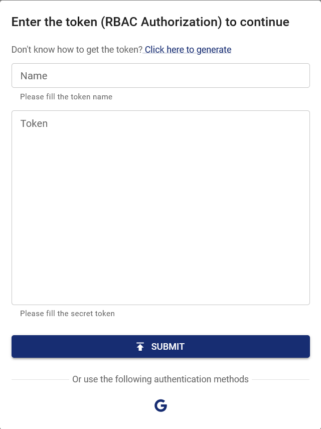

當 Chaos Mesh 部署在 Google Cloud Platform 時，您可以透過 Google OAuth 登入 Chaos Dashboard。本文件說明如何啟用與設定此功能。

## 建立 OAuth 用戶端

請依據[設定 OAuth 2.0](https://support.google.com/cloud/answer/6158849?hl=en) 的指引建立 GCP OAuth 用戶端，並取得用戶端 ID 和用戶端密鑰。

1. 前往 [Google Cloud Platform 控制台](https://console.cloud.google.com/)。

2. 從專案清單中選擇現有專案或建立新專案。

3. 若未自動載入「API 和服務」頁面，請手動開啟控制台左側選單並選擇「API 和服務」。

4. 點擊左側的「憑證」。

5. 點擊「建立憑證」後選擇「OAuth 用戶端 ID」。

6. Select "Web Application" as the application type, and enter additional information and the redirect URL of Chaos dashboard, which is `ROOT_URL/api/auth/gcp/callback`. In this part, `ROOT_URL` is the root URL of Chaos dashboard, like `http://localhost:2333`. This URL can be set through the configuration item `dashboard.rootUrl` by `helm`.

7. 點擊「建立」。

建立用戶端後，請務必保存用戶端 ID 和用戶端密鑰以供後續步驟使用。

## 設定並啟動 Chaos Mesh

:::info

Update: Since `v2.7.0`, you can provide a **Secret** to store the Client ID and Client Secret. **We recommend you to use this method**.

This change is to avoid exposing the Client ID and Client Secret to the public. In the previous versions, the Client ID and Client Secret are specified in the values directly, which is not safe in general.

For more information, see https://github.com/chaos-mesh/chaos-mesh/issues/4206.

:::

啟用此功能需在 helm charts 中設定以下配置項目：

```yaml
dashboard:
  rootUrl: http://localhost:2333
  gcpSecurityMode:
    enabled: true
    # Old configuration items for compatibility.
    clientId: ''
    clientSecret: ''
    # References existing Kubernetes secret containing `GCP_CLIENT_ID` and `GCP_CLIENT_SECRET`.
    existingSecret: ''
```

若已安裝 Chaos Mesh，可透過 `helm upgrade` 更新設定；若未安裝，則透過 `helm install` 進行部署。

## 使用 Google 登入

開啟 Chaos Dashboard，於驗證視窗點擊 Google 圖示。



登入 Google 帳戶並授予 OAuth 用戶端權限後，頁面將自動導向至已登入狀態的 Chaos Dashboard。此時您擁有與 Google 帳戶相同的叢集權限。如需新增權限，可透過 RBAC（基於角色的存取控制）進行編輯，例如：

```yaml
kind: ClusterRole
apiVersion: rbac.authorization.k8s.io/v1
metadata:
  name: chaos-mesh-cluster-manager
rules:
  - apiGroups:
      - chaos-mesh.org
    resources: ['*']
    verbs: ['get', 'list', 'watch', 'create', 'delete', 'patch', 'update']
---
kind: ClusterRoleBinding
apiVersion: rbac.authorization.k8s.io/v1
metadata:
  name: cluster-manager-binding
  namespace: chaos-mesh
subjects:
  - kind: User
    name: example@gmail.com
roleRef:
  kind: ClusterRole
  name: chaos-mesh-cluster-manager
  apiGroup: rbac.authorization.k8s.io
```

此設定將使使用者 `example@gmail.com` 具備查看或建立任何混沌實驗的權限。