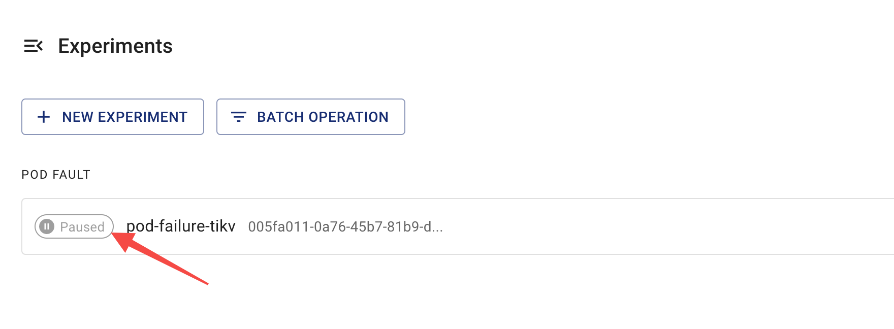

本文件說明如何使用 Chaos Mesh 檢查混亂實驗的運行狀態與結果。

## 混亂實驗步驟介紹

在 Chaos Mesh 中，混亂實驗的生命週期根據運行流程分為四個步驟：

- **注入中 (Injecting)**：混亂實驗正處於故障注入過程。此步驟通常持續時間較短。若「注入中」狀態持續過久，可能是實驗發生異常。此時可檢查 `Events` 以找出異常原因。

- **運行中 (Running)**：當故障成功注入所有目標 Pod 後，混亂實驗即進入運行狀態。

- **已暫停 (Paused)**：對運行中的混亂實驗執行[暫停流程](run-a-chaos-experiment.md#pause-chaos-experiments)時，Chaos Mesh 會從所有目標 Pod 恢復已注入的故障，表示實驗已暫停。

- **已完成 (Finished)**：若實驗配置了 `duration` 參數，當運行時間到達設定值時，Chaos Mesh 會從所有目標 Pod 恢復已注入的故障，表示實驗已完成。

## 透過 Chaos Dashboard 檢查結果

您可在 Chaos Dashboard 的以下任一頁面查看混亂實驗的運行步驟：

- 混亂實驗清單頁面：

  

- 混亂實驗詳情頁面：

  

:::note

- 若 **「注入中」** 狀態持續過久，可能是混亂實驗發生異常（例如配置的選擇器未選中目標 Pod）。此時可檢查 **`Events`** 找出異常原因並驗證實驗配置。
- Chaos Dashboard 僅顯示[混亂實驗的主要步驟](#introduction-to-steps-of-a-chaos-experiment)。如需更詳細的實驗狀態與結果資訊，請執行 `kubectl` 命令。

:::

## 透過 `kubectl` 命令檢查結果

要確認混亂實驗結果，請使用以下 `kubectl describe` 命令檢查實驗物件的 `Status` 和 `Events`。

```shell
kubectl describe podchaos pod-failure-tikv -n tidb-cluster
```

預期輸出如下：

```shell
...
Status:
  Conditions:
    Reason:
    Status:  False
    Type:    Paused
    Reason:
    Status:  True
    Type:    Selected
    Reason:
    Status:  True
    Type:    AllInjected
    Reason:
    Status:  False
    Type:    AllRecovered
  Experiment:
    Container Records:
      Id:            tidb-cluster/basic-tikv-0
      Phase:         Injected
      Selector Key:  .
    Desired Phase:   Run
Events:
  Type    Reason           Age   From          Message
  ----    ------           ----  ----          -------
  Normal  FinalizerInited  39s   finalizer     Finalizer has been inited
  Normal  Paused           39s   desiredphase  Experiment has been paused
  Normal  Updated          39s   finalizer     Successfully update finalizer of resource
  Normal  Updated          39s   records       Successfully update records of resource
  Normal  Updated          39s   desiredphase  Successfully update desiredPhase of resource
  Normal  Started          17s   desiredphase  Experiment has started
  Normal  Updated          17s   desiredphase  Successfully update desiredPhase of resource
  Normal  Applied          17s   records       Successfully apply chaos for tidb-cluster/basic-tikv-0
  Normal  Updated          17s   records       Successfully update records of resource
```

上述輸出包含兩個部分：

- `Status`

  根據混亂實驗的運行流程，`Status` 提供四種狀態記錄：
  
  - `Paused`：表示混亂實驗處於「已暫停」步驟
  - `Selected`：表示實驗已正確選中要注入混亂操作的目標 Pod
  - `AllInjected`：表示故障已成功注入所有目標 Pod
  - `AllRecoverd`：表示已成功從所有目標 Pod 恢復注入的故障

  可從這四種狀態記錄推斷當前實驗的實際運行狀態。例如：
  
  - 當 `Paused`、`Selected`、`AllRecoverd` 為 `True` 且 `AllInjected` 為 `False` 時，表示當前實驗已暫停
  - 當 `Paused` 為 `True` 時，表示實驗已暫停。但若同時 `Selected` 為 `False`，則表示當前實驗無法選中目標 Pod

  :::note

  您可從狀態記錄的組合獲取更多資訊。例如當 `Paused` 為 `True` 表示實驗暫停，但若同時 `Selected` 為 `False`，則表示當前實驗無法選中要注入混亂操作的目標 Pod。

  :::

- `Events`

  包含混亂實驗整個生命週期中的操作記錄，有助於檢查實驗狀態與疑難排解。