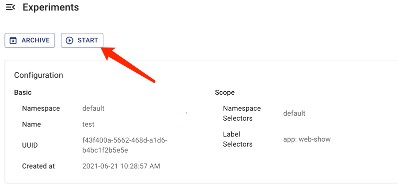

本文件說明如何在 Chaos Mesh 中建立、執行、檢視、暫停、更新及刪除混沌實驗。

## 建立混沌實驗

您可以在 Chaos Mesh 中建立以下類型的混沌實驗：

- 一次性混沌實驗：混沌實驗的最小實例。一次性實驗建立後，Chaos Mesh 會立即根據實驗配置將故障注入目標測試機器。若配置了 `duration` 參數，注入的故障會在 `duration` 指定的時間後自動恢復。當混沌實驗暫停或刪除時，注入的故障會立即恢復。

- 排程或循環混沌實驗：可定期或循環執行的混沌實驗。建立此類實驗時需定義實驗的排程規則。

### 一次性混沌實驗

若要建立一次性混沌實驗，可使用以下任一方法：

- 使用 Chaos Dashboard 建立新混沌實驗，點擊 **提交** 執行實驗。詳細操作請參考各混沌實驗類型的專屬文件。

- 使用 YAML 檔案定義混沌實驗，再透過 `kubectl` 建立並執行實驗。若採用此方式，請執行以下步驟：

1. Create a new YAML file to define a Chaos experiment. Add configuration parameters in the file based on the type of Chaos experiment you want to create.

   Take a NetworkChaos experiment as an example. Save the following YAML text as `network-delay.yaml`.

   ```yaml
   apiVersion: chaos-mesh.org/v1alpha1
   kind: NetworkChaos
   metadata:
     name: network-delay
   spec:
     action: delay # the specific chaos action to inject
     mode: one # the mode to run chaos action; supported modes are one/all/fixed/fixed-percent/random-max-percent
     selector: # pods where to inject chaos actions
       namespaces:
         - default
       labelSelectors:
         'app': 'web-show' # the label of the pod for chaos injection
     delay:
       latency: '10ms'
     duration: '12s'
   ```

   The above YAML example defines a network latency fault lasting for `12 seconds`, targeting applications with the `"app": "web-show"` tag under the `default` namespace. For more configuration information about the NetworkChaos experiment, refer to [Simulate network chaos](simulate-network-chaos-on-kubernetes.md).

2. 執行以下指令以建立並執行此混沌實驗。

   ```sh
   kubectl apply -f network-delay.yaml
   ```

3. 混沌實驗開始後，若要檢視其執行狀態，使用以下 `kubectl describe` 指令檢查此實驗物件的 `status` 或 `event`。

   ```sh
   kubectl describe networkchaos network-delay
   ```

   檢視混沌實驗結果的詳細步驟，請參考[檢查混沌實驗](inspect-chaos-experiments.md)。

### 排程或循環混沌實驗

Chaos Mesh 提供 `Schedule` 物件來建立排程混沌實驗和循環混沌實驗。

若要建立此類混沌實驗，請執行以下步驟：

1. 建立一個新的 YAML 檔案來定義混沌實驗。您需要在 YAML 檔案中配置 `Schedule` 參數來定義實驗的具體排程規則，然後根據您要建立的混沌實驗類型配置其他參數。

   以排程型 NetworkChaos 實驗為例。將以下 YAML 文字儲存為 `schedule-delay-example.yaml`。

   ```yaml
   apiVersion: chaos-mesh.org/v1alpha1
   kind: Schedule
   metadata:
     name: schedule-delay-example
   spec:
     schedule: '5 * * * *'
     historyLimit: 2
     concurrencyPolicy: 'Allow'
     type: 'NetworkChaos'
     networkChaos:
       action: delay
       mode: one
       selector:
         namespaces:
           - default
         labelSelectors:
           'app': 'web-show'
       delay:
         latency: '10ms'
       duration: '12s'
   ```

   以上 YAML 範例定義了一個每小時第 5 分鐘自動觸發的網路延遲故障。關於排程規則的詳細說明，請參閱[定義排程規則](define-scheduling-rules.md)。

   :::note

   若未設定 `duration` 參數，故障行為將持續生效直到您暫停或刪除混沌實驗。

   :::

2. 執行以下指令來建立並運行此混沌實驗。

   ```sh
   kubectl apply -f schedule-delay-example.yaml
   ```

3. 在混沌實驗開始運行後，若要查看運行狀態，可使用以下 `kubectl describe` 指令檢查實驗物件的 `status` 或 `event`。

   ```sh
   kubectl describe networkchaos schedule-delay-example
   ```

   查看混沌實驗結果的詳細步驟，請參閱[檢查混沌實驗](inspect-chaos-experiments.md)。

## 暫停混沌實驗

### 使用指令暫停或恢復混沌實驗

對於運行中的混沌實驗，您可透過指令設定暫停註解(pause annotation)來暫停實驗。

例如，您可使用以下指令暫停預設命名空間中名為 `network-delay` 的混沌實驗：

```sh
kubectl annotate networkchaos network-delay experiment.chaos-mesh.org/pause=true
```

此指令執行後，Chaos Mesh 會立即恢復已注入的故障。若您希望將混沌實驗從暫停狀態恢復至正常運行狀態，請使用以下指令：

```sh
kubectl annotate networkchaos network-delay experiment.chaos-mesh.org/pause-
```

### 使用 Chaos Dashboard 暫停或恢復混沌實驗

若需透過 Chaos Dashboard 暫停或恢復混沌實驗，請在儀表板上找到目標實驗，點擊 **Pause** 按鈕或 **Start** 按鈕。




## 更新混沌實驗

### 使用指令更新混沌實驗

混沌實驗的 `Spec` 字段目前不允許更新。

詳情請參閱相關的 [GitHub issue](https://github.com/chaos-mesh/chaos-mesh/issues/2227)。

### 使用 Chaos Dashboard 更新混沌實驗

由於混沌實驗的 `Spec` 字段不允許更新，Chaos Dashboard 目前不支援更新混沌實驗。

## 刪除混沌實驗

### 使用指令刪除混沌實驗

混沌實驗完成後，您可透過以下 `kubectl delete` 指令刪除實驗。刪除混沌實驗後，已注入的故障將立即恢復：

```sh
kubectl delete -f network-delay.yaml
# or delete the chaos object directly
kubectl delete networkchaos network-delay
```

若刪除操作受阻，表示目標物件的部分故障行為無法恢復。您可檢查 Chaos Mesh 日誌進行故障排除，或直接建立 [GitHub issue](https://github.com/pingcap/chaos-mesh/issues) 向 Chaos Mesh 團隊回報此問題。此外，您可透過以下指令強制刪除混沌實驗：

```sh
kubectl annotate networkchaos web-show-network-delay chaos-mesh.chaos-mesh.org/cleanFinalizer=forced
```

### 使用 Chaos Dashboard 刪除混沌實驗

若要在 Chaos Dashboard 上刪除混沌實驗並將其歸檔至實驗歷史記錄，您可以點擊該混沌實驗對應的 **Archive** 按鈕。

