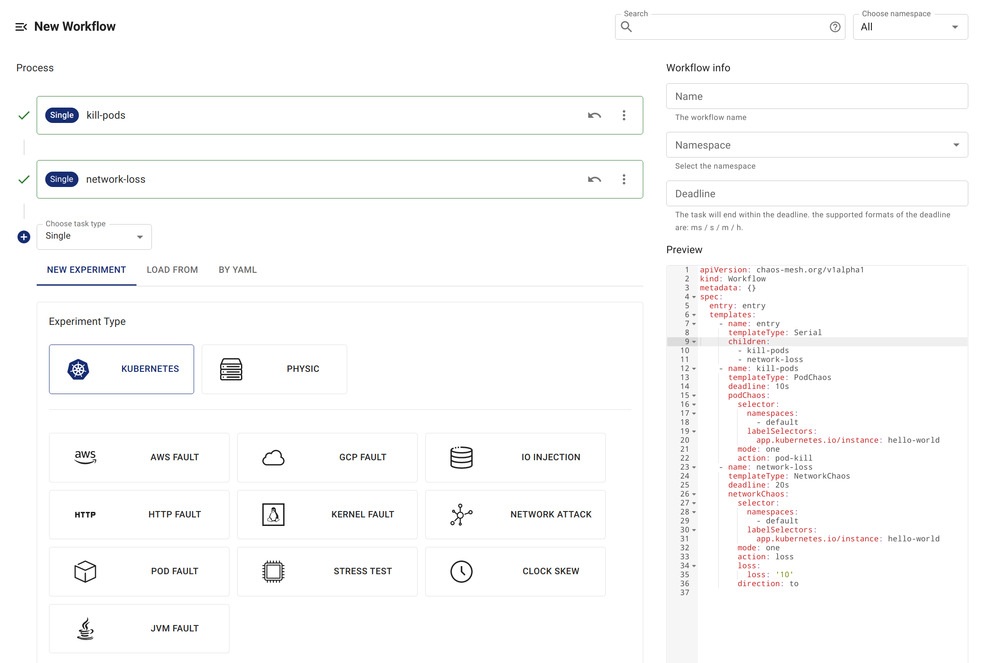
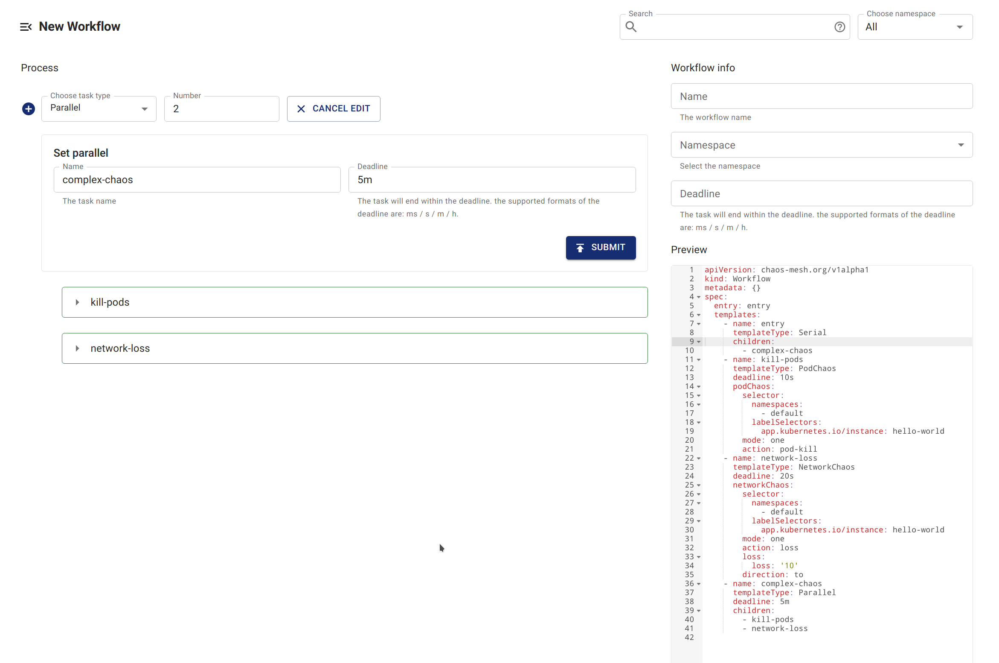

Chaos Mesh Workflow 提供兩種實驗排程方式：序列執行與並行執行。您可以根據需求配置並排程多個實驗。

- 若需依序排程多個混沌實驗，請使用序列節點。

- 若需同時執行多個混沌實驗，請使用並行節點。

Chaos Mesh 在設計序列與並行節點時採用[組合模式](https://en.wikipedia.org/wiki/Composite_pattern)。此模式可容納多種不同類型的節點，並以特定模式執行組合節點。這也意味著您可以嵌套序列與並行節點，實現複雜的排程邏輯。

## 序列實驗

在 Workflow 中建立 `templates` 時，使用 `templateType: Serial` 宣告序列節點。

序列節點中另一必要欄位為 `children`，其類型為 `[]string`，值為其他 `template` 的名稱。例如：

```yaml
apiVersion: chaos-mesh.org/v1alpha1
kind: Workflow
metadata:
  name: try-workflow-serial
spec:
  entry: serial-of-3-node
  templates:
    - name: serial-of-3-node
      templateType: Serial
      deadline: 240s
      children:
        - workflow-stress-chaos
        - suspending
        - workflow-network-chaos
    - name: suspending
      templateType: Suspend
      deadline: 10s
    - name: workflow-network-chaos
      templateType: NetworkChaos
      deadline: 20s
      networkChaos:
        direction: to
        action: delay
        mode: all
        selector:
          labelSelectors:
            'app': 'hello-kubernetes'
        delay:
          latency: '90ms'
          correlation: '25'
          jitter: '90ms'
    - name: workflow-stress-chaos
      templateType: StressChaos
      deadline: 20s
      stressChaos:
        mode: one
        selector:
          labelSelectors:
            'app': 'hello-kubernetes'
        stressors:
          cpu:
            workers: 1
            load: 20
            options: ['--cpu 1', '--timeout 600']
```

上述指令宣告名為 `serial-of-3-node` 的序列節點，表示 Chaos Mesh 將依序執行 `workflow-stress-chaos`、`suspending` 與 `workflow-network-chaos`。所有任務完成後，序列節點標記為已完成。

Chaos Mesh 執行序列節點時，`children` 中的任務將依序執行，確保同一時間僅有一個任務運行。

序列節點中的 `deadline` 為可選欄位，用於限制整個序列流程的最長持續時間。若超過此時限，子節點將被終止且未執行的節點不再執行。若所有子節點在 `deadline` 時限前完成，序列節點立即標記為完成，且不受 `deadline` 影響。

## 並行實驗

在 Workflow 中建立 `templates` 時，使用 `templateType: Parallel` 宣告並行節點。

並行節點中另一必要欄位為 `children`，其類型為 `[]string`，值為其他 `template` 的名稱。例如：

```yaml
apiVersion: chaos-mesh.org/v1alpha1
kind: Workflow
metadata:
  name: try-workflow-parallel
spec:
  entry: parallel-of-2-chaos
  templates:
    - name: parallel-of-2-chaos
      templateType: Parallel
      deadline: 240s
      children:
        - workflow-stress-chaos
        - workflow-network-chaos
    - name: workflow-network-chaos
      templateType: NetworkChaos
      deadline: 20s
      networkChaos:
        direction: to
        action: delay
        mode: all
        selector:
          labelSelectors:
            'app': 'hello-kubernetes'
        delay:
          latency: '90ms'
          correlation: '25'
          jitter: '90ms'
    - name: workflow-stress-chaos
      templateType: StressChaos
      deadline: 20s
      stressChaos:
        mode: one
        selector:
          labelSelectors:
            'app': 'hello-kubernetes'
        stressors:
          cpu:
            workers: 1
            load: 20
            options: ['--cpu 1', '--timeout 600']
```

上述指令宣告名為 `parallel-of-2-chaos` 的並行節點，表示 Chaos Mesh 將同時執行 `workflow-stress-chaos` 與 `workflow-network-chaos`。所有任務完成後，並行節點標記為已完成。

Chaos Mesh 執行並行節點時，`children` 中的所有任務將同時執行。

類似序列節點，並行節點也可選用 `deadline` 欄位限制整個並行流程的最長執行時間。若達此時限，子節點將被終止。若所有子節點在 `deadline` 時限前完成，並行節點立即標記為完成，且不受 `deadline` 影響。

## 使用 Chaos Dashboard 建立含序列或並行節點的工作流

### 建立序列節點

Chaos Dashboard 預先建立名為 `entry` 的序列節點。因此透過 Chaos Dashboard 建立含序列節點的工作流時，預設會在 `entry` 下建立。



### 建立並行節點

您可以建立名為 `Parallel` 的並行節點，並在 `Parallel` 下建立子節點。



### 嵌套序列與並行節點

您可以通過嵌套序列與並行節點建立更複雜的流程。

