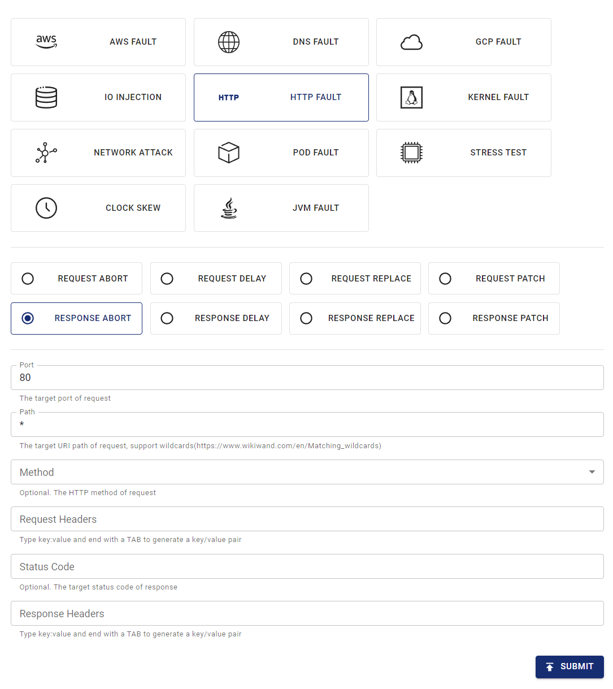

本文件說明如何透過在 Chaos Mesh 中建立 HTTPChaos 實驗來模擬 HTTP 故障。

## HTTPChaos 介紹

HTTPChaos 是 Chaos Mesh 提供的故障類型。透過建立 HTTPChaos 實驗，您可以模擬 HTTP 請求和響應處理過程中的故障場景。目前 HTTPChaos 支援模擬以下故障類型：

- `abort`：中斷連線

- `delay`：在請求或響應中注入延遲

- `replace`：替換 HTTP 請求或響應訊息中的部分內容

- `patch`：在 HTTP 請求或響應訊息中添加額外內容

HTTPChaos 支援不同故障類型的組合。若在建立 HTTPChaos 實驗時同時配置多個 HTTP 故障類型，實驗運行時注入故障的順序為 `abort` -> `delay` -> `replace` -> `patch`。當 `abort` 故障導致短路時，連線將直接中斷。

有關 HTTPChaos 配置的詳細說明，請參閱下方的[欄位說明](#field-description)。

## 注意事項

在注入 HTTPChaos 支援的故障前，請注意以下事項：

- 目標 Pod 上沒有運行 Chaos Mesh 的控制管理器。

- 規則預設會影響 Pod 中的客戶端和伺服器端，若需僅影響單側，請參閱[指定側](#specify-side)章節。

- 應禁用 HTTPS 訪問，因為目前不支援注入 HTTPS 連線。

- 為使 HTTPChaos 注入生效，客戶端應避免重複使用 TCP 通訊端。這是因為 HTTPChaos 不會影響故障注入前透過 TCP 通訊端發送的 HTTP 請求。

- 在生產環境中謹慎使用非冪等請求（例如大多數 POST 請求）。若使用此類請求，故障注入後目標服務可能無法透過重複請求恢復正常狀態。

## 使用 Chaos Dashboard 建立實驗

1. 開啟 Chaos Dashboard，點擊頁面上的**新建實驗**建立新實驗：

   

2. 在**選擇目標**區域，選擇 **HTTP 故障**並選取特定行為（例如 `RESPONSE ABORT`），然後填寫具體配置。

   

3. 提交實驗。

   在上述範例中，您已配置將「響應中止」故障注入 Port 80 的所有請求。

## 使用 YAML 檔案建立實驗

Chaos Mesh 也支援使用 YAML 配置檔案建立 HTTPChaos 實驗。在 YAML 檔案中，您可以模擬單一 HTTP 故障類型或多種 HTTP 故障類型的組合。

### `abort` 範例

1. 將實驗配置寫入 `http-abort-failure.yaml` 檔案，範例如下：

   ```yaml
   apiVersion: chaos-mesh.org/v1alpha1
   kind: HTTPChaos
   metadata:
     name: test-http-chaos
   spec:
     mode: all
     selector:
       labelSelectors:
         app: nginx
     target: Request
     port: 80
     method: GET
     path: /api
     abort: true
     duration: 5m
   ```

   根據此配置範例，Chaos Mesh 將在 5 分鐘內向指定 Pod 注入 `abort` 故障。故障注入期間，目標 Pod 在 `/api` 路徑透過 Port 80 發送的 GET 請求將被中斷。

2. 準備好配置檔案後，使用 `kubectl` 建立實驗：

   ```bash
   kubectl apply -f ./http-abort-failure.yaml
   ```

### 故障組合範例

1. 將實驗配置寫入 `http-failure.yaml` 檔案，如下例所示：

   ```yaml
   apiVersion: chaos-mesh.org/v1alpha1
   kind: HTTPChaos
   metadata:
     name: test-http-chaos
   spec:
     mode: all
     selector:
       labelSelectors:
         app: nginx
     target: Request
     port: 80
     method: GET
     path: /api/*
     delay: 10s
     replace:
       path: /api/v2/
       method: DELETE
     patch:
       headers:
         - ['Token', '<one token>']
         - ['Token', '<another token>']
       body:
         type: JSON
         value: '{"foo": "bar"}'
     duration: 5m
   ```

   根據此配置範例，Chaos Mesh 將連續注入 `delay` 故障、`replace` 故障和 `patch` 故障。

2. 準備好配置檔案後，使用 `kubectl` 建立實驗：

   ```bash
   kubectl apply -f ./http-failure.yaml
   ```

## 欄位描述

### 通用欄位描述

當故障注入的 `target` 為 `Request` 或 `Response` 時，通用欄位才具有意義。

| Parameter | Type | Description | Default value | Required | Example |
| --- | --- | --- | --- | --- | --- |
| `mode` | string | Specifies the mode of the experiment. The mode options include `one` (selecting a random pod), `all` (selecting all eligible pods), `fixed` (selecting a specified number of eligible pods), `fixed-percent` (selecting a specified percentage of Pods from the eligible pods), and `random-max-percent` (selecting the maximum percentage of Pods from the eligible pods). |  | yes | `one` |
| `value` | string | Provides parameters for the `mode` configuration depending on the value of `mode`. |  | no | 1 |
| `target` | string | Specifies whether the target of fault injuection is `Request` or `Response`. The [`target`-related fields](#description-for-target-related-fields) should be configured at the same time. |  | yes | Request |
| `port` | int32 | The TCP port that the target service listens on. |  | yes | 80 |
| `path` | string | The URI path of the target request. Supports [Matching wildcards](https://www.wikiwand.com/en/Matching_wildcards). | Takes effect on all paths by default. | no | /api/\* |
| `method` | string | The HTTP method of the target request method. | Takes effect for all methods by default. | no | GET |
| `request_headers` | map[string]string | Matches request headers to the target service. | Takes effect for all requests by default. | no | Content-Type: application/json |
| `abort` | bool | Indicates whether to inject the fault that interrupts the connection. | false | no | true |
| `delay` | string | Specifies the time for a latency fault. | 0 | no | 10s |
| `replace.headers` | map[string]string | Specifies the key pair used to replace the request headers or response headers. |  | no | Content-Type: application/xml |
| `replace.body` | []byte | Specifies request body or response body to replace the fault (Base64 encoded). |  | no | eyJmb28iOiAiYmFyIn0K |
| `patch.headers` | [][]string | Specifies the attached key pair of the request headers or response headers with patch faults. |  | no | - [Set-Cookie, one cookie] |
| `patch.body.type` | string | Specifies the type of patch faults of the request body or response body. Currently, it only supports [`JSON`](https://tools.ietf.org/html/rfc7396). |  | no | JSON |
| `patch.body.value` | string | Specifies the fault of the request body or response body with patch faults. |  | no | `{"foo": "bar"}` |
| `duration` | string | Specifies the duration of a specific experiment. |  | yes | 30s |
| `scheduler` | string | Specifies the scheduling rules for the time of a specific experiment. |  | no | 5 \* \* \* \* |
| `tls.secretName` | string | SecretName represents the name of required secret resource. The secrete must combined with data `{"tls.certName":cert, "tls.KeyName":key, "tls.caName":ca}` |  | no | "http-tls-scr" |
| `tls.secretNamespace` | string | SecretNamespace represents the namespace of required secret resource,should be the same with deployment/chaos-controller-manager in most cases |  | no | "chaos-mesh" |
| `tls.certName` | string | CertName represents the data name of cert file in secret, `tls.crt` for example |  | no | "tls.crt" |
| `tls.KeyName` | string | KeyName represents the data name of key file in secret, `tls.key` for example |  | no | "tls.key" |
| `tls.caName` | string | CAName represents the data name of ca file in secret, `ca.crt` for example |  | no | "ca.crt" |

:::note

- 使用 YAML 檔案建立實驗時，`replace.body` 必須是替換內容的 base64 編碼。
- 使用 Kubernetes API 建立實驗時，不需要對替換內容進行編碼，只需將其轉換為 `[]byte` 並放入 `httpchaos.Spec.Replace.Body` 欄位。以下為範例：

```golang
httpchaos.Spec.Replace.Body = []byte(`{"foo": "bar"}`)
```

:::

### `target` 相關欄位描述

#### `Request` 相關欄位

The `Request` field is a meaningful when the `target` set to `Request` during the fault injection.

| Parameter | Type | Description | Default value | Required | Example |
| --- | --- | --- | --- | --- | --- |
| `replace.path` | string | Specifies the URI path used to replace content. |  | no | /api/v2/ |
| `replace.method` | string | Specifies the replaced content of the HTTP request method. |  | no | DELETE |
| `replace.queries` | map[string]string | Specifies the replaced key pair of the URI query. |  | no | foo: bar |
| `patch.queries` | [][]string | Specifies the attached key pair of the URI query with patch faults. |  | no | - [foo, bar] |

#### `Respond`-related fields

The `Response` is a meaningful when the `target` set to `Response` during the fault injection.

| Parameter | Type | Description | Default value | Required | Example |
| --- | --- | --- | --- | --- | --- |
| `code` | int32 | Specifies the status code responded by `target`. | Takes effect for all status codes by default. | no | 200 |
| `response_headers` | map[string]string | Matches request headers to `target`. | Takes effect for all responses by default. | no | Content-Type: application/json |
| `replace.code` | int32 | Specifies the replaced content of the response status code. |  | no | 404 |

## 指定端

預設情況下，規則將同時影響 Pod 中的客戶端和伺服器端，但您可以透過選擇請求標頭來僅影響其中一端。

本節提供一些指定受影響端的範例，您可以根據具體情況調整規則中的標頭選擇器。

### 客戶端

若要將故障注入 Pod 中的客戶端而不影響伺服器端，您可以透過請求中的 `Host` 標頭來選擇請求/回應。

例如，如果您想中斷對 `http://example.com/` 的所有請求，可以套用以下 YAML 配置：

```yaml
apiVersion: chaos-mesh.org/v1alpha1
kind: HTTPChaos
metadata:
  name: test-http-client
spec:
  mode: all
  selector:
    labelSelectors:
      app: some-http-client
  target: Request
  port: 80
  path: '*'
  request_headers:
    Host: 'example.com'
  abort: true
```

### 伺服器端

若要將故障注入 Pod 中的伺服器端而不影響客戶端，您也可以透過請求中的 `Host` 標頭來選擇請求/回應。

例如，如果您想中斷對服務 `nginx.nginx.svc` 後端伺服器的所有請求，可以套用以下 YAML 配置：

```yaml
apiVersion: chaos-mesh.org/v1alpha1
kind: HTTPChaos
metadata:
  name: test-http-server
spec:
  mode: all
  selector:
    labelSelectors:
      app: nginx
  target: Request
  port: 80
  path: '*'
  request_headers:
    Host: 'nginx.nginx.svc'
  abort: true
```

在其他情況下，特別是當注入來自外部的入站請求時，您可以透過請求中的 `X-Forwarded-Host` 標頭來選擇請求/回應。

例如，如果您想中斷對公共網關 `nginx.host.org` 後端伺服器的所有請求，可以套用以下 YAML 配置：

```yaml
apiVersion: chaos-mesh.org/v1alpha1
kind: HTTPChaos
metadata:
  name: test-http-server
spec:
  mode: all
  selector:
    labelSelectors:
      app: nginx
  target: Request
  port: 80
  path: '*'
  request_headers:
    X-Forwarded-Host: 'nginx.host.org'
  abort: true
```

## TLS

若要基於 TLS 在連線內部注入故障，使用者應使用 TLS 模式。我們的代理在此扮演代理角色，因此在 TLS 中，人們既需要充當具有可信 CA 的遠端伺服器，也需要充當信任該伺服器的客戶端（使用一些 CA）。

因此在以下的密鑰資料中，使用者需要自行建立其 TLS 金鑰、CA 及 CRT。

```
{
  "tls.certName":cert,
  "tls.KeyName":key,
  "tls.caName":ca
}
```

若使用者需要建立新的 TLS 伺服器並將連線注入其中，則應執行下列步驟：

1. 建立自己的根 CA 私鑰及根 CA 憑證：

   ```
   openssl req -newkey rsa:4096  -x509  -sha512  -days 365 -nodes -out ca.crt -keyout ca.key
   ```

2. 建立伺服器的憑證簽署要求 (CSR)：

   ```
   openssl genrsa -out server.key 2048
   openssl req -new -key server.key -out server.csr
   ```

3. 為伺服器撰寫擴充檔案 `server.ext`，內容範例如下：

   ```
   authorityKeyIdentifier=keyid,issuer
   basicConstraints=CA:FALSE
   keyUsage = digitalSignature, nonRepudiation, keyEncipherment, dataEncipherment
   subjectAltName = @alt_names

   [alt_names]
   IP.1 = X.X.X.X
   ```

4. 產生伺服器憑證：

   ```
   openssl x509 -req -in server.csr -CA ca.crt -CAkey ca.key -CAcreateserial -out server.crt -days 365 -sha256 -extfile server.ext
   ```

5. 將 CA `ca.crt` 加入用戶端。

6. 將 `server.key`、`server.crt` 及 `ca.crt` 放入密鑰 (secret) 中，並提供給 TLS 模式。

若需要注入用戶端，則應讓 HTTP Chaos 的代理扮演遠端伺服器，只需將上述的 `server.ext` 編輯為指定的網域即可。

範例：

```
subjectAltName = @alt_names

[alt_names]
DNS.1 = *.domain.com
IP.1 = xxx.xxx.xxx.xxx
```

## 本地除錯

若不確定某些故障注入的效果，您也可以使用 [rs-tproxy](https://github.com/chaos-mesh/rs-tproxy) 在本機測試對應功能。Chaos Mesh 也透過 chaos-tproxy 提供 HTTP Chaos。