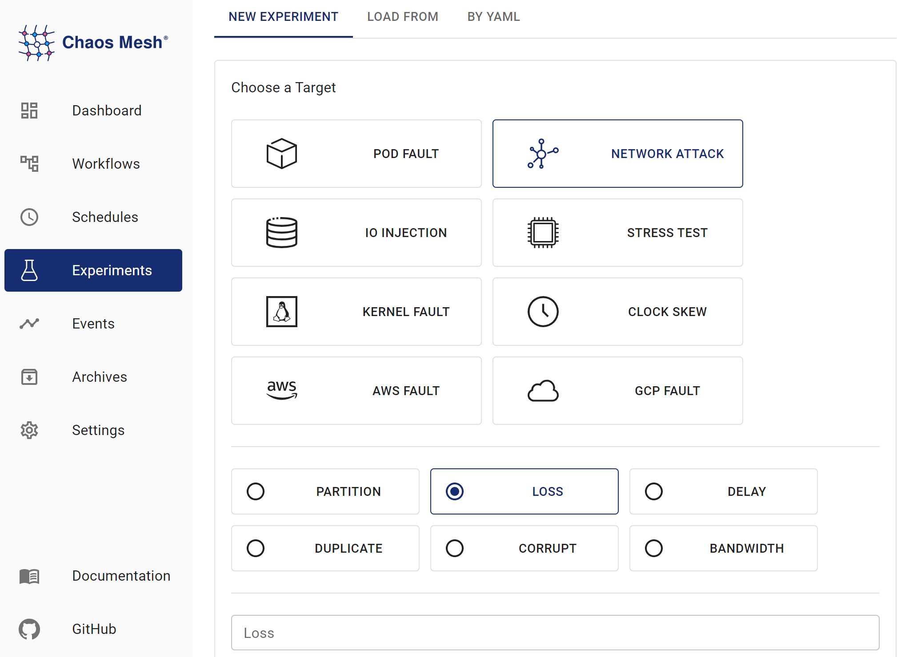

本文件描述如何使用 Chaos Mesh 中的 NetworkChaos 模擬網路故障。

## NetworkChaos 介紹

NetworkChaos 是 Chaos Mesh 中的一種故障類型。透過建立 NetworkChaos 實驗，您可以為集群模擬網路故障場景。目前，NetworkChaos 支援以下故障類型：

- **Partition**：網路中斷和分割。

- **Net Emulation**：不良的網路條件，例如高延遲、高封包遺失率、封包重新排序等。

- **Bandwidth**：限制節點之間的通信頻寬。

## 注意事項

在建立 NetworkChaos 實驗之前，請確保以下事項：

1. 在網路注入過程中，確保 Controller Manager 與 Chaos Daemon 之間的連接正常，否則 NetworkChaos 將無法恢復。

2. 如果要模擬 Net Emulation 故障，請確保 Linux 核心中安裝了 NET_SCH_NETEM 模組。如果您使用的是 CentOS，可以透過 kernel-modules-extra 套件安裝此模組。大多數其他 Linux 發行版預設已安裝此模組。

## 使用 Chaos Dashboard 建立實驗

1. 開啟 Chaos Dashboard，在頁面上點擊 **NEW EXPERIMENT** 以建立新實驗：

   

2. 在 **Choose a Target** 區域中，選擇 **NETWORK ATTACK** 並選擇一個特定行為，例如 **LOSS**。然後填寫具體配置。

   

   有關具體配置欄位的詳細資訊，請參閱[欄位描述](#field-description)。

3. 填寫實驗資訊，並指定實驗範圍和排程的實驗持續時間。

   

4. 提交實驗資訊。

## 使用 YAML 檔案建立實驗

### 延遲範例

1. 將實驗配置寫入 `network-delay.yaml` 檔案，如下所示：

   ```yaml
   apiVersion: chaos-mesh.org/v1alpha1
   kind: NetworkChaos
   metadata:
     name: delay
   spec:
     action: delay
     mode: one
     selector:
       namespaces:
         - default
       labelSelectors:
         'app': 'web-show'
     delay:
       latency: '10ms'
       correlation: '100'
       jitter: '0ms'
   ```

   此配置在目標 Pod 的網路連接中造成 10 毫秒的延遲。除了延遲注入外，Chaos Mesh 還支援封包遺失和封包重新排序注入。有關詳細資訊，請參閱[欄位描述](#field-description)。

2. 準備好配置檔案後，使用 `kubectl` 建立實驗：

   ```bash
   kubectl apply -f ./network-delay.yaml
   ```

### 分割範例

1. 將實驗配置寫入 `network-partition.yaml` 檔案，如下所示：

   ```yaml
   apiVersion: chaos-mesh.org/v1alpha1
   kind: NetworkChaos
   metadata:
     name: partition
   spec:
     action: partition
     mode: all
     selector:
       namespaces:
         - default
       labelSelectors:
         'app': 'app1'
     direction: to
     target:
       mode: all
       selector:
         namespaces:
           - default
         labelSelectors:
           'app': 'app2'
   ```

   此配置阻斷從 `app1` 到 `app2` 建立的連接。`direction` 欄位的值可以是 `to`、`from` 或 `both`。有關詳細資訊，請參閱[欄位描述](#field-description)。

2. 準備好配置檔案後，使用 `kubectl` 建立實驗：

   ```bash
   kubectl apply -f ./network-partition.yaml
   ```

### 頻寬範例

1. 將實驗配置寫入 `network-bandwidth.yaml` 檔案，如下所示：

   ```yaml
   apiVersion: chaos-mesh.org/v1alpha1
   kind: NetworkChaos
   metadata:
     name: bandwidth
   spec:
     action: bandwidth
     mode: all
     selector:
       namespaces:
         - default
       labelSelectors:
         'app': 'app1'
     bandwidth:
       rate: '1mbps'
       limit: 20971520
       buffer: 10000
   ```

   此配置將 `app1` 的頻寬限制為 1 mbps。

2. 準備好配置檔案後，使用 `kubectl` 建立實驗：

   ```bash
   kubectl apply -f ./network-bandwidth.yaml
   ```

### 網路模擬範例

1. 將實驗配置寫入 `netem.yaml` 檔案，如下所示：

   ```yaml
   apiVersion: chaos-mesh.org/v1alpha1
   kind: NetworkChaos
   metadata:
     name: network-emulation
   spec:
     action: netem
     mode: all
     selector:
       namespaces:
         - default
       labelSelectors:
         'app': 'web-show'
     delay:
       latency: '10ms'
       correlation: '100'
       jitter: '0ms'
     rate:
       rate: '10mbps'
   ```

   此配置在目標 Pod 的網路連線中造成 10 毫秒延遲和 10mbps 頻寬限制。除了延遲和速率外，`netem` 操作還支援封包丟失、重新排序和損壞。

2. 準備好配置檔案後，使用 `kubectl` 建立實驗：

   ```bash
   kubectl apply -f ./netem.yaml
   ```

## 欄位描述

| Parameter | Type | Description | Default value | Required | Example |
| --- | --- | --- | --- | --- | --- |
| action | string | Indicates the specific fault type. Available types include: `netem`, `delay` (network delay), `loss` (packet loss), `duplicate` (packet duplicating), `corrupt` (packet corrupt), `partition` (network partition), and `bandwidth` (network bandwidth limit). After you specify `action` field, refer to [Description for `action`-related fields](#description-for-action-related-fields) for other necessary field configuration. | None | Yes | Partition |
| target | Selector | Used in combination with direction, making Chaos only effective for some packets. | None | No |  |
| direction | enum | Indicates the direction of `target` packets. Available values include `from` (the packets from `target`), `to` (the packets to `target`), and `both` ( the packets from or to `target`). This parameter makes Chaos only take effect for a specific direction of packets. | to | No | both |
| mode | string | Specifies the mode of the experiment. The mode options include `one` (selecting a random Pod), `all` (selecting all eligible Pods), `fixed` (selecting a specified number of eligible Pods), `fixed-percent` (selecting a specified percentage of Pods from the eligible Pods), and `random-max-percent` (selecting the maximum percentage of Pods from the eligible Pods). | None | Yes | `one` |
| value | string | Provides a parameter for the `mode` configuration, depending on `mode`. For example, when `mode` is set to `fixed-percent`, `value` specifies the percentage of Pods. | None | No | 1 |
| selector | struct | Specifies the target Pod. For details, refer to [Define the experiment scope](./define-chaos-experiment-scope.md). | None | Yes |  |
| externalTargets | []string | Indicates the network targets except for Kubernetes, which can be IPv4 addresses or domains. This parameter only works with `direction: to`. | None | No | 1.1.1.1, google.com |
| device | string | Specifies the affected network interface | None | No | "eth0" |

## `action` 相關欄位描述

對於網路模擬和頻寬故障類型，您可以根據以下描述進一步配置 `action` 相關參數。

- 網路模擬類型：`delay`、`loss`、`duplicated`、`corrupt`、`rate`

- 頻寬類型：`bandwidth`

### delay

將 `action` 設定為 `delay` 表示模擬網路延遲故障。您也可以配置以下參數。

| Parameter | Type | Description | Required | Required | Example |
| --- | --- | --- | --- | --- | --- |
| latency | string | Indicates the network latency | No | No | 2ms |
| correlation | string | Indicates the correlation between the current latency and the previous one. Range of value: [0, 100] | No | No | 50 |
| jitter | string | Indicates the range of the network latency | No | No | 1ms |
| reorder | Reorder(#Reorder) | Indicates the status of network packet reordering |  | No |  |

`correlation` 的計算模型如下：

1. 產生與前一個值相關的隨機數：

   ```c
   rnd = value * (1-corr) + last_rnd * corr
   ```

   `rnd` 是隨機數。`corr` 是您先前填寫的 `correlation`。

2. 使用此隨機數決定當前封包的延遲：

   ```c
   ((rnd % (2 * sigma)) + mu) - sigma
   ```

   上述指令中，`sigma` 是 `jitter`，`mu` 是 `latency`。

### reorder

將 `action` 設定為 `reorder` 表示模擬網路封包重新排序故障。您也可以配置以下參數。

| Parameter | Type | Description | Default value | Required | Example |
| --- | --- | --- | --- | --- | --- |
| reorder | string | Indicates the probability to reorder | 0 | No | 0.5 |
| correlation | string | Indicates the correlation between this time's length of delay time and the previous time's length of delay time. Range of value: [0, 100] | 0 | No | 50 |
| gap | int | Indicates the gap before and after packet reordering | 0 | No | 5 |

### loss

將 `action` 設定為 `loss` 表示模擬封包丟失故障。您也可以配置以下參數。

| Parameter | Type | Description | Default value | Required | Example |
| --- | --- | --- | --- | --- | --- |
| loss | string | Indicates the probability of packet loss. Range of value: [0, 100] | 0 | No | 50 |
| correlation | string | Indicates the correlation between the probability of current packet loss and the previous time's packet loss. Range of value: [0, 100] | 0 | No | 50 |

### duplicate

將 `action` 設定為 `duplicate`，表示模擬封包重複。此時，您也可以設定以下參數。

| Parameter | Type | Description | Default value | Required | Example |
| --- | --- | --- | --- | --- | --- |
| duplicate | string | Indicates the probability of packet duplicating. Range of value: [0, 100] | 0 | No | 50 |
| correlation | string | Indicates the correlation between the probability of current packet duplicating and the previous time's packet duplicating. Range of value: [0, 100] | 0 | No | 50 |

### corrupt

將 `action` 設定為 `corrupt` 表示模擬封包損壞故障。您也可以配置以下參數。

| Parameter | Type | Description | Default value | Required | Example |
| --- | --- | --- | --- | --- | --- |
| corrupt | string | Indicates the probability of packet corruption. Range of value: [0, 100] | 0 | No | 50 |
| correlation | string | Indicates the correlation between the probability of current packet corruption and the previous time's packet corruption. Range of value: [0, 100] | 0 | No | 50 |

對於偶發事件，例如 `reorder`、`loss`、`duplicate` 和 `corrupt`，其 `correlation` 的計算較為複雜。具體模型描述請參閱 [NetemCLG](http://web.archive.org/web/20200120162102/http://netgroup.uniroma2.it/twiki/bin/view.cgi/Main/NetemCLG)。

### rate

將 `action` 設定為 `rate` 表示模擬頻寬速率故障。此操作與下方的 [bandwidth/rate](#bandwidth) 類似，但**關鍵區別在於此操作可與上述其他 `netem` 操作結合使用**。若需更精細控制頻寬模擬（如限制緩衝區大小），請使用 [bandwidth](#bandwidth) 操作。

| Parameter | Type | Description | Default value | Required | Example |
| --- | --- | --- | --- | --- | --- |
| rate | string | Indicates the rate of bandwidth limit. Allows bit, kbit, mbit, gbit, tbit, bps, kbps, mbps, gbps, tbps unit. bps means bytes per second |  | Yes | 1mbps |

### bandwidth

將 `action` 設定為 `bandwidth` 表示模擬頻寬限制故障。您還需配置以下參數。

:::info

此操作與上述任何 `netem` 操作互斥。若需同時注入頻寬速率及其他網路故障（如封包損壞），請改用 [rate](#rate) 操作。

:::

| Parameter | Type | Description | Default value | Required | Example |
| --- | --- | --- | --- | --- | --- |
| rate | string | Indicates the rate of bandwidth limit. Allows bit, kbit, mbit, gbit, tbit, bps, kbps, mbps, gbps, tbps unit. bps means bytes per second |  | Yes | 1mbps |
| limit | uint32 | Indicates the number of bytes waiting in queue |  | Yes | 1 |
| buffer | uint32 | Indicates the maximum number of bytes that can be sent instantaneously |  | Yes | 1 |
| peakrate | uint64 | Indicates the maximum consumption of `bucket` (usually not set) |  | No | 1 |
| minburst | uint32 | Indicates the size of `peakrate bucket` (usually not set) |  | No | 1 |

For more details of these fields, you can refer to [tc-tbf document](https://man7.org/linux/man-pages/man8/tc-tbf.8.html). The limit is suggested to set to at least `2 * rate * latency`, where the `latency` is the estimated latency between source and target, and it can be estimated through `ping` command. Too small `limit` can cause high loss rate and impact the throughput of the tcp connection.