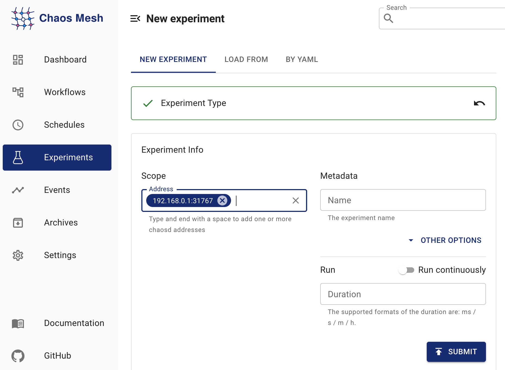

本文件說明如何在 Chaos Mesh 中建立 PhysicalMachineChaos（實體機器混沌）實驗，以模擬實體或虛擬機器中的網路、磁碟、壓力、JVM、時間及其他故障。

## PhysicalMachineChaos 簡介

您可以使用 PhysicalMachineChaos 來模擬實體或虛擬機器中的網路、磁碟、壓力、JVM、時間及其他故障。在使用 Chaos Mesh 提供的 PhysicalMachineChaos 之前，您需要在實體或虛擬機器中部署 Chaosd。Chaos Mesh 和 Chaosd 的版本對應關係如下：

| Chaos Mesh version | Chaosd version |
| :----------------- | :------------- |
| v2.1.x             | v1.1.x         |
| v2.2.x             | v1.2.x         |

## 部署 Chaosd 伺服器

在使用 Chaos Mesh 建立 PhysicalMachineChaos 實驗之前，您需要以服務模式在所有將被注入故障的實體或虛擬機器中部署 Chaosd。部署 Chaosd 後，請按照以下方式執行 Chaosd 伺服器：

1. 部署 Chaosd、產生 TLS 憑證並建立 `PhysicalMachine`：
   
   - 有關 Chaosd 的部署方法，請參閱[下載並部署 Chaosd](chaosd-overview.md#download-and-deploy)。
   - 部署 Chaosd 後，在啟動 Chaosd 伺服器**之前**，您需要產生 TLS 憑證並在 Kubernetes 叢集中建立 `PhysicalMachine`。有關如何產生 TLS 憑證的更多資訊，請參閱[為 Chaosd 產生 TLS 憑證](chaosctl-tool.md#generate-tls-certificates-for-chaosd)。

2. 啟動 Chaosd 伺服器：
   
   - 透過 Chaosctl 產生 TLS 憑證後，執行以下指令以服務模式啟動 Chaosd：
   
     ```bash
     chaosd server --https-port 31768 --CA=/etc/chaosd/pki/ca.crt --cert=/etc/chaosd/pki/chaosd.crt --key=/etc/chaosd/pki/chaosd.key
     ```
     
     :::note
     
     TLS 憑證儲存於 Chaosctl 的預設輸出目錄。若您在產生憑證時手動指定了其他目錄，請將指令行中的目錄替換為相應的目錄。
     
     :::

- 若未透過 Chaosctl 產生 TLS 憑證，您可以執行以下指令以服務模式啟動 Chaosd。但基於叢集安全考量，此方式**不建議**使用：
  
  ```bash
  chaosd server --port 31767
  ```

## 使用 Chaos Dashboard 建立實驗

1. 開啟 Chaos Dashboard，在頁面上點擊 **NEW EXPERIMENT** 以建立新實驗：
   
   

2. 在 **Experiment Type** 中點擊 **PHYSIC**，並選擇實驗的特定類型，例如 **NETWORK ATTACK**。然後，選擇特定行為並填寫相應的配置：
   
   

3. 填寫實驗資訊以指定實驗的範圍和計劃持續時間：
   
   

4. 提交實驗。

## 使用 YAML 檔案建立實驗

1. 將實驗配置寫入 "physicalmachine.yaml" 檔案。例如：
   
   ```yaml
   apiVersion: chaos-mesh.org/v1alpha1
   kind: PhysicalMachineChaos
   metadata:
     name: physical-network-delay
     namespace: chaos-mesh
   spec:
     action: network-delay
     mode: one
     selector:
       namespaces:
         - default
       labelSelectors:
         'arch': 'amd64'
     network-delay:
       device: ens33
       ip-address: 140.82.112.3
       latency: 1000ms
     duration: '10m'
   ```
   
   上述實驗配置向指定實體或虛擬機器中的 Chaosd 服務發送 HTTP 請求，以觸發網路延遲實驗。

2. 使用 `kubectl` 建立實驗。指令如下：
   
   ```bash
   kubectl apply -f physicalmachine.yaml
   ```

### 配置說明

| Configuration item | Type | Description | Default value | Required | Example |
| :-- | :-- | :-- | :-- | :-- | :-- |
| `action` | string | Defines the actions of physical machines faults, optional values are as follows: `stress-cpu`, `stress-mem`, `disk-read-payload`, `disk-write-payload`, `disk-fill`, `network-corrupt`, `network-duplicate`, `network-loss`, `network-delay`, `network-partition`, `network-dns`, `process`, `jvm-exception`, `jvm-gc`, `jvm-latency`, `jvm-return`, `jvm-stress`, `jvm-rule-data`, `clock` | None | Yes | `stress-cpu` |
| `address` | string array | Selects the `address` of Chaosd service to inject faults, only one of `address` or `selector` could be specified | [] | Yes | ["192.168.0.10:31767"] |
| `selector` | struct | Specifies the target PhysicalMachine. For details, refer to [Define the experiment scope](define-chaos-experiment-scope.md), only one of `address` or `selector` could be specified | None | No |  |
| `mode` | string | Specifies the mode of the experiment. The mode options include `one` (selecting a random PhysicalMachine), `all` (selecting all eligible PhysicalMachines), `fixed` (selecting a specified number of eligible PhysicalMachines), `fixed-percent` (selecting a specified percentage of PhysicalMachines from the eligible PhysicalMachines), and `random-max-percent` (selecting the maximum percentage of PhysicalMachines from the eligible PhysicalMachines). | None | Yes | `one` |
| `value` | string | Provides a parameter for the `mode` configuration, depending on `mode`. For example, when `mode` is set to `fixed-percent`, `value` specifies the percentage of PhysicalMachines. | None | No | `1` |
| `duration` | string | Specifies the duration of experiments | None | Yes | `30s` |

每個故障動作都有其特定的配置參數。以下章節將介紹各類故障類型及其對應的配置方法。

#### CPU 壓力

若要模擬 CPU 壓力場景，需將動作設定為 "stress-cpu"。對應配置請參閱模擬 CPU 壓力的參數說明。

#### 記憶體壓力

若要模擬記憶體壓力場景，需將動作設定為 "stress-mem"。對應配置請參閱模擬記憶體壓力的參數說明。

#### 磁碟讀取負載

若要模擬磁碟讀取負載場景，需將動作設定為 "disk-read-payload"。對應配置請參閱模擬磁碟讀取負載的參數說明。

#### 磁碟寫入負載

若要模擬磁碟寫入負載場景，需將動作設定為 "disk-write-payload"。對應配置請參閱模擬磁碟寫入負載的參數說明。

#### 磁碟填充

若要模擬磁碟填充場景，需將動作設定為 "disk-fill"。對應配置請參閱模擬磁碟填充的參數說明。

#### 網路封包損壞

若要模擬網路封包損壞場景，需將動作設定為 "network-corrupt"。對應配置請參閱模擬網路封包損壞的參數說明。

#### 網路延遲

若要模擬網路延遲場景，需將動作設定為 "network-delay"。對應配置請參閱模擬網路延遲的參數說明。

#### 網路封包重複

若要模擬網路封包重複場景，需將動作設定為 "network-duplicate"。對應配置請參閱模擬網路封包重複的參數說明。

#### 網路封包遺失

若要模擬網路封包遺失場景，需將動作設定為 "network-loss"。對應配置請參閱模擬網路封包遺失的參數說明。

#### 網路分割

若要模擬網路分割場景，需將動作設定為 "network-partition"。對應配置請參閱模擬網路分割的參數說明。

#### DNS 故障

若要模擬 DNS 故障場景，需將動作設定為 "network-dns"。對應配置請參閱模擬 DNS 故障的參數說明。

#### 進程故障

若要模擬進程故障場景，需將動作設定為 "process"。對應配置請參閱模擬進程故障的參數說明。

#### 觸發 JVM 應用程式自訂例外

若要模擬 JVM 應用程式拋出自訂例外場景，需將動作設定為 "jvm-exception"。對應配置請參閱拋出自訂例外的參數說明。

#### 增加 JVM 應用程式方法延遲

若要模擬 JVM 應用程式增加方法延遲場景，需將動作設定為 "jvm-latency"。對應配置請參閱增加方法延遲的參數說明。

#### 修改 JVM 應用程式方法返回值

若要模擬 JVM 應用程式修改方法返回值場景，需將動作設定為 "jvm-return"。對應配置請參閱修改方法返回值的參數說明。

#### 觸發 JVM 應用程式垃圾回收

若要模擬 JVM 應用程式觸發垃圾回收場景，需將動作設定為 "jvm-gc"。對應配置請參閱觸發垃圾回收的參數說明。

#### 透過 Byteman 配置檔案觸發 JVM 應用程式故障

要模擬 JVM 應用程式使用 Byteman 設定檔觸發故障的情境，您需要將 action 設定為 "jvm-rule-data"。對應的配置，請參考設定 Byteman 設定檔觸發故障的參數。

#### 時間偏移

要模擬時間偏移的情境，您需要將 action 設定為 "clock"。對應的配置，請參考模擬時間偏移的參數。